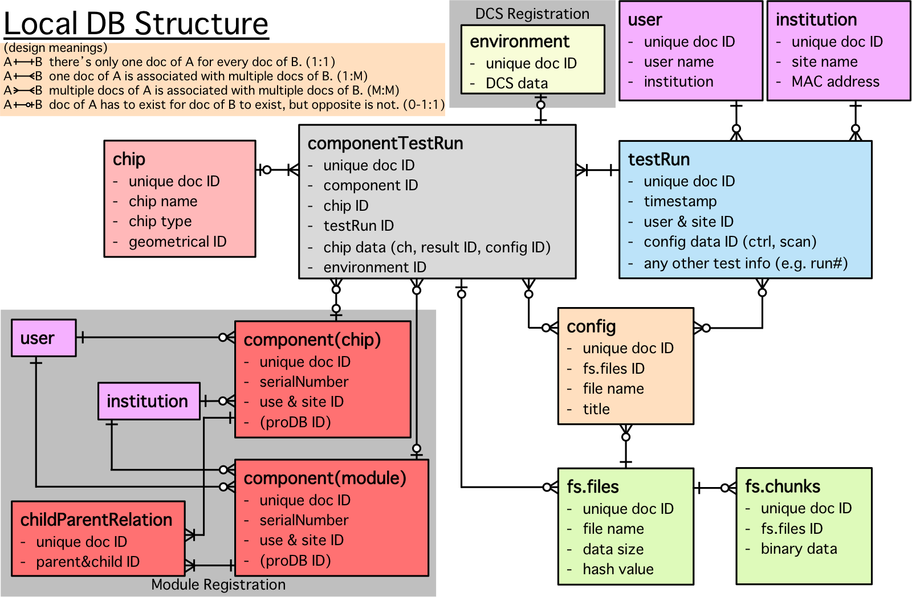

# Database name list
* **localdb**  
Main database for YARR DB

* **localdbtools**  
Database for using in localDB tools e.g.) _synchronization DB_ function

# Data Structure

## **localdb**

# Collections (= tables in SQL) name list
## in **localdb**
* [**component**](https://github.com/jlabhep/Yarr/wiki/component)  
Component information of chips and modules 

* [**childParentRelation**](https://github.com/jlabhep/Yarr/wiki/childParentRelation)  
Relationship between chips and modules 

* [**testRun**](https://github.com/jlabhep/Yarr/wiki/testRun)  
Test (scan) information for each component with attachments information

* [**componentTestRun**](https://github.com/jlabhep/Yarr/wiki/componentTestRun)  
Relationship between component and testRun

* [**config**](https://github.com/jlabhep/Yarr/wiki/config)  
Config file information

* [**user**](https://github.com/jlabhep/Yarr/wiki/user)  
User information

* [**institution**](https://github.com/jlabhep/Yarr/wiki/institution)  
Site information

* [**environment**](https://github.com/jlabhep/Yarr/wiki/environment)  
DCS information

* [**fs.files**](https://github.com/jlabhep/Yarr/wiki/GridFS) (GridFS)  
Binary (text) File information

* [**fs.chunks**](https://github.com/jlabhep/Yarr/wiki/GridFS) (GridFS)  
Binary (text) File chunks
