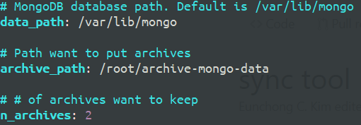
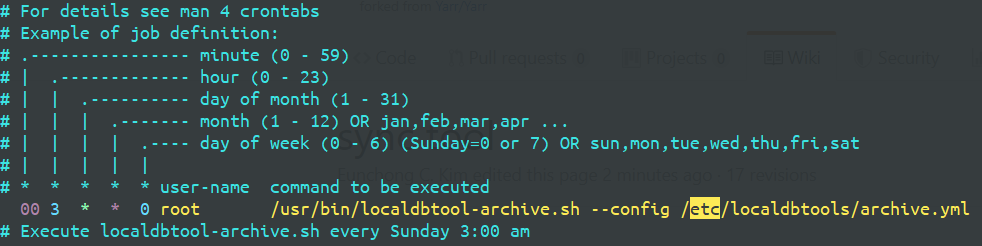

# 1. Introduction
The archive-tool creates a/some archive tar.gz files to back-up local database.


# 2. Getting start
## a) download
```
git clone https://github.com/jlab-hep/localDB-tools.git
cd localDB-tools/archive-tool
source setup_archive_tool.sh
```

## b) configure servers
edit `my_archive_configure.yml` to config your local mongoDB database directory and where to put archives.



* `data_path: /var/lib/mongo`: path where the local data is. Default path is `/var/lib/mongo`.
* `archive_path: /root/archive-mongo-data`: path where the archives will be put. We recommend to use external HDD/SSD.
* `n_archives: 2`: # of archives. It depends on size of your disk storage.

## c) (ADVANCE) install to run archive-tool automatically
`make install` with root privileges. Then edit the configure file `/etc/localdbtools/archive.yml`.
The archive-tool `/usr/bin/localdbtool-archive.sh` will be run automatically as schedule task by `cron`. The `cron` configure is `/etc/cron.d/localdbtool-archive`. By default, the task will be executed every Sunday 3:00 am.




# 3. Usage
```
./bin/localdbtool-archive.sh -f my_archive_configure.yml
```

## a) options
* `-f|--config`: path to configure file.
* `-d|--data-path`: path to local data directory.
* `-a|--archive-path`: path to archives will be put.
* `-n|--n-archives`: # of archives to keep.
