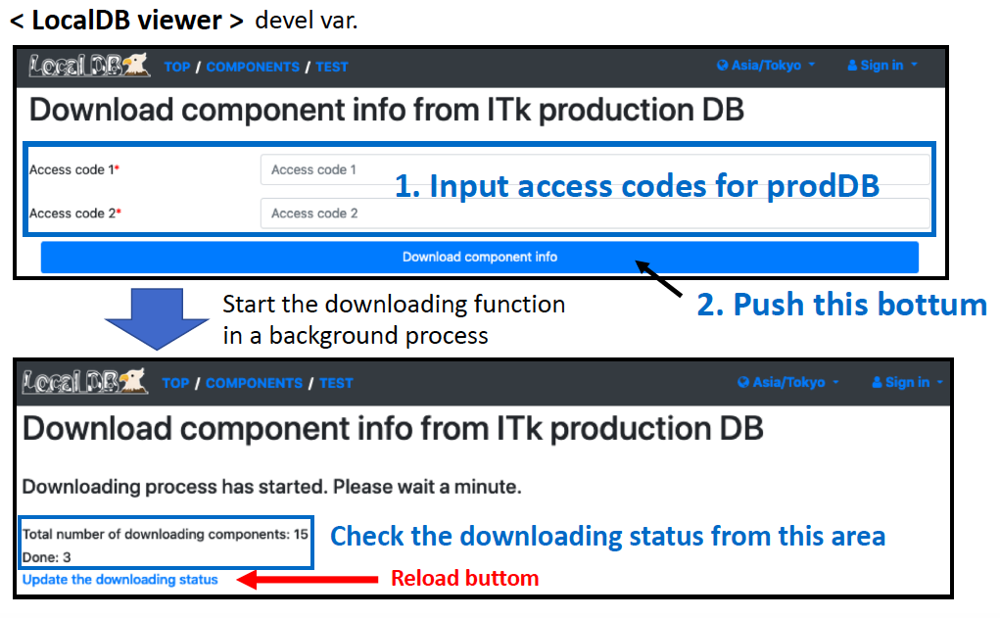

# Module Download from ITkPD

### View the LocalDB viewer from DAQ machine
If you want to see LocalDB viewer on your browse, you should execute the bellow comand.
```bash
$ ssh -2 -C -Y -L 5000:localhost:5000 root@localdbserverX -fN
Password:
```

Download the component data from ITkPD.<br>
Go to the downloading page [http://127.0.0.1:5000/localdb/download_component](http://127.0.0.1:5000/localdb/download_component)



You can check the downloaded component data using Viewer Application.<br>
Check [http://127.0.0.1:5000/localdb/component](http://127.0.0.1:5000/localdb/component) on the machine's browser where app.py is running,<br>
and there are the module data whose serial number is ATLAS serial number.

Finish installation. Back to the previous page and go to next step.
