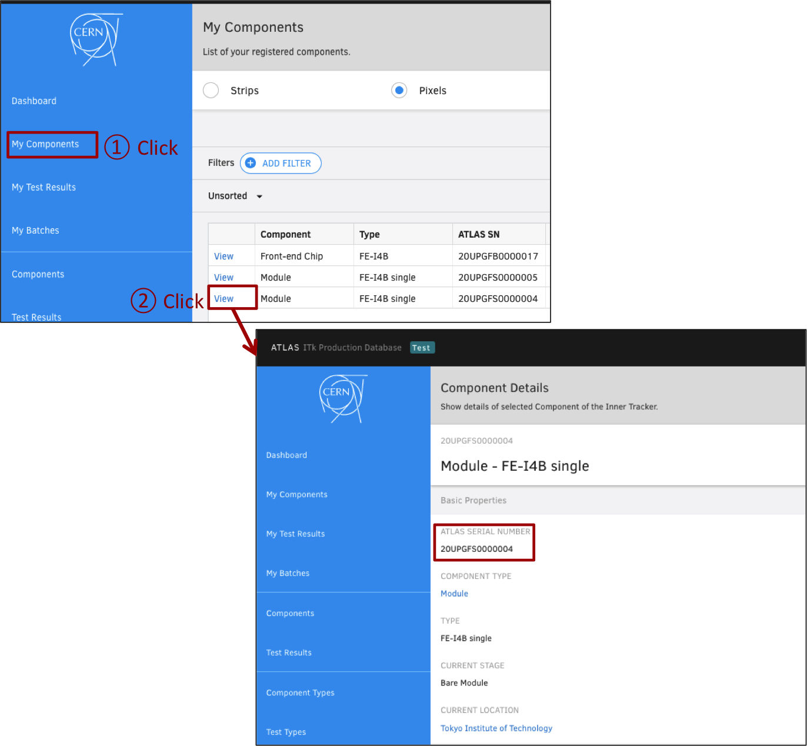

# Module Download from ITkPD

## Goal

Download the component data (FE-I4B single module data & FE-I4B FE chip data for example) from ITkPD.

<!--
## 1. Check ATLAS Serial Number in ITkPD Web Page
You can skip this process if you do not have ITkPD account.
Access [https://itkpd-test.unicorncollege.cz/](https://itkpd-test.unicorncollege.cz/) and login with your ACCESS CODE 1 & ACCESS CODE 2.<br>

1. Click "My Components" in the side bar.
2. Click "Viewer" to select the FE-I4B single module data from the list.
3. Check the "ATLAS SERIAL NUMBER" for the module data.



## 2. Set-up the interface between ITkPD and Local DB

Set-up some interface commands by 'setup_interface_tool.sh' to communicate with ITk PD.
In this step, you have to set the editor command (e.g. vim, emacs) if the environmental variable 'EDITOR' has not registered.

```bash
$ cd localdb-tools/itkpd-interface/
$ ./setup_interface_tool.sh
[LDB] Welcome!
[LDB] Check python modules ...
[LDB] Welcome to Local Database Tools!
[LDB] Check python modules...
[LDB] Requirements already satisfied
[LDB] Set editor command ... > vim
<some texts>
[LDB] Finish!
```

## 3. ITkPD Authentication

```bash
$ source authenticate.sh
Input Access Code 1 for ITkPD:    # your ACCESS CODE 1
Input Access Code 2 for ITkPD:    # your ACCESS CODE 2
```

## 4. Download component data from ITkPD to Local DB

```bash
$ cd localdb-tools/itkbd-interface
$ ./bin/downloader.py --config my_conf.yml --option Module
```
-->

You can check the downloaded component data using Viewer Application.<br>
Check [http://127.0.0.1:5000/localdb/component](http://127.0.0.1:5000/localdb/component) on the machine's browser where app.py is running,<br>
and there are the module data whose serial number is ATLAS serial number.

Finish!
