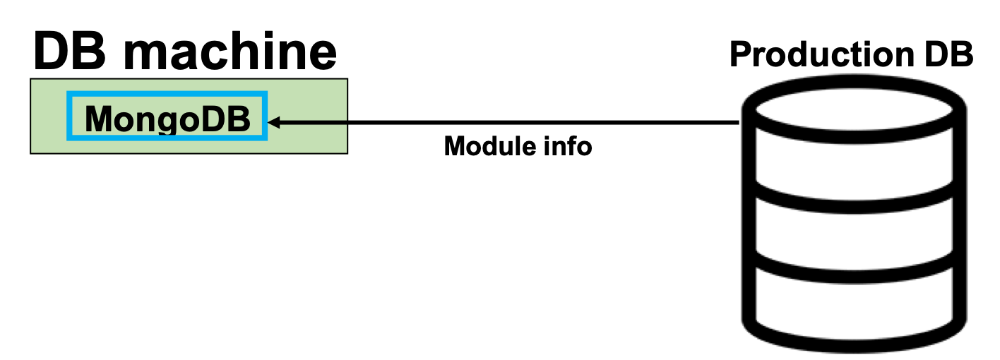

# Module Download from Production DB

### Create ssh tunnel 
To see LocalDB viewer on your browser, do the bellow comand on your command prompt.<br>
**Change the server name according to the given name** (e.g.:root@localdbserver1)<br> 
Password is the DB server account's password.(Default is "password".)

```bash
$ ssh -L 5000:localhost:5000 root@localdbserverX -fN
Password:
```


### Download component information from Production DB 
Download the component data from Production DB.<br>

Go to the downloading page [http://127.0.0.1:5000/localdb/download_component](http://127.0.0.1:5000/localdb/download_component)<br><br>

**Input LocalDB admin's username and password for "Authentication Required".**<br><br>


Follow the instruction bellow to download module from prodDB:


You can check the downloaded component data using Viewer Application.<br>
Check [http://127.0.0.1:5000/localdb/components](http://127.0.0.1:5000/localdb/components) on your browser,<br>
and there are the components whose serial number is ATLAS serial number.<br><br>

We use a RD53A module's property in this tutorial.<br>
Device's serial number is "20UPGRS0000009", chip's serial number is "20UPGRA0000026". Check the information in the viewer.<br><br>



Finish. Back to the previous page and go to next step.
