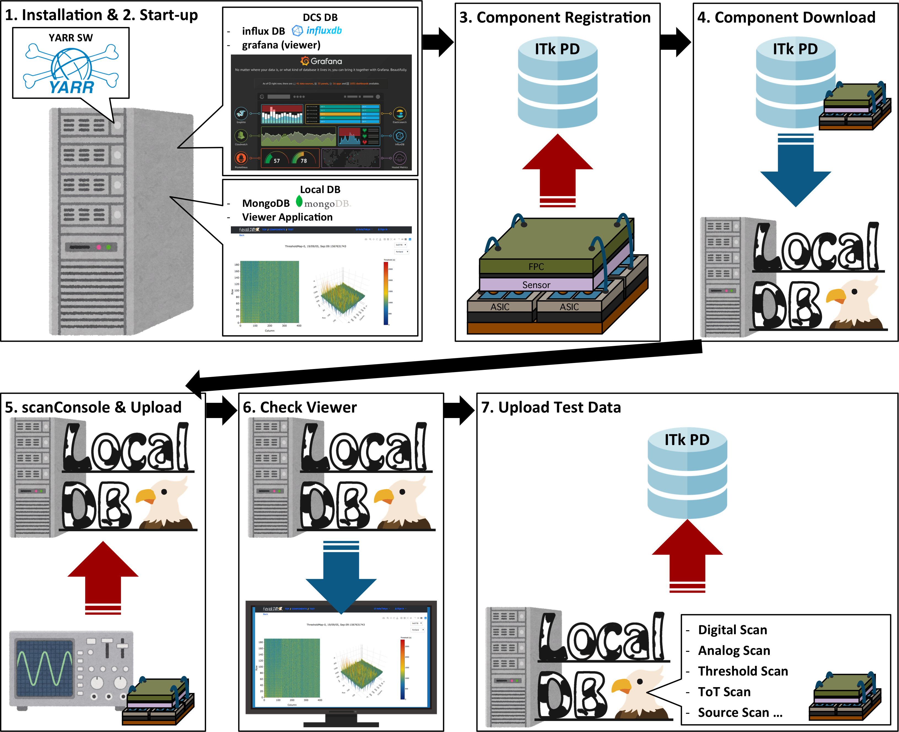

# Database Demonstration

## Structure of SW and DB

Production DB: A central DB for ITk,setup in Czech.
MongoDB: A local DB to store module info, scan results and so on. 
InfluxDB: A local DB to store DCS data.  
LocalDB viewer: A web application to see the contents of mongoDB. 
Grafana: A web application to see the contents of influxDB.  

Assume we have two machines, DAQ machine and DB machine in this tutorial. 
DAQ machine is the local machine you use in the room. Run YARR-SW and DCS controller. Get scan results and DCS sata in this machine and send DB machine the taken data. 
DB machine is the remote machine to store the scan and DCS data. Install mongoDB, InfluxDB and some related functions.  
Firstly, we create the environment for QC tutorial to install the DB and SW to each machine. Then we demonstrate QC according to the following flow. 

## Tutorial Flow
In DB demonstration, we can do as follow things:

### Installation for DB machine
1. [Installation](database_demonstration_install_db_machine.md) 
2. [Setting for MongoDB](database_demonstration_mongodb.md) 
3. [Setting for LocalDB viewer](database_demonstration_viewer.md) 

### Installation for DAQ machine
1. [Installation](database_demonstration_install_daq_machine.md) 

### QC Flow
1. [Module Download](database_demonstration_download_itkpd.md) 
Download the module data into Local DB from ITkPD.
2. [Hook up module to devices and Run DCS controller](database_demonstration_run_dcs.md) 
Run DCS controller and get values(environment temp,current,voltage)
3. [Check DCS data Grafana](database_demonstration_grafana.md) 
Checking the data in Grafana
4. [scanConsole and tuning](database_demonstration_scanconsole.md) 
Run scanConsole with storing the test data into Local DB
5. [Select and Upload results into ITkPD](database_demonstration_upload_itkpd.md) 
Upload the results into ITkPD

<!--

-->
