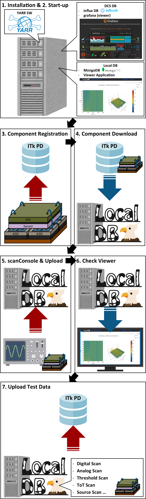

# Database demonstration flow

## Pre Requirements

Check [the requirements for DB demonstration](database_demonstration_requirements.md) to install the required packages.

_We support CentOS, MacOS, Ubuntu, Windows_

## Flow

Following DB demonstration, we can do as follow things:

1. [Install required packages (pre requirements)](database_demonstration_requirements.md)
2. [Set-up MongoDB, influxDB, Grafana, Viewer Application, Plotting Tool, and YARR SW for Local DB](database_demonstration_setup.md)
3. [Register the module data into ITkPD (as test)](database_demonstration_register_itkpd.md)
4. [Download the module data into Local DB from ITkPD (as test)](database_demonstration_download_itkpd.md)
5. [Run scanConsole with uploading the test data into Local DB](database_demonstration_scanconsole.md)
6. [Check the uploaded data in the Viewer Application](database_demonstration_viewer.md)
7. [Upload the test data into ITkPD (if possible)](database_demonstration_upload_itkpd.md)

