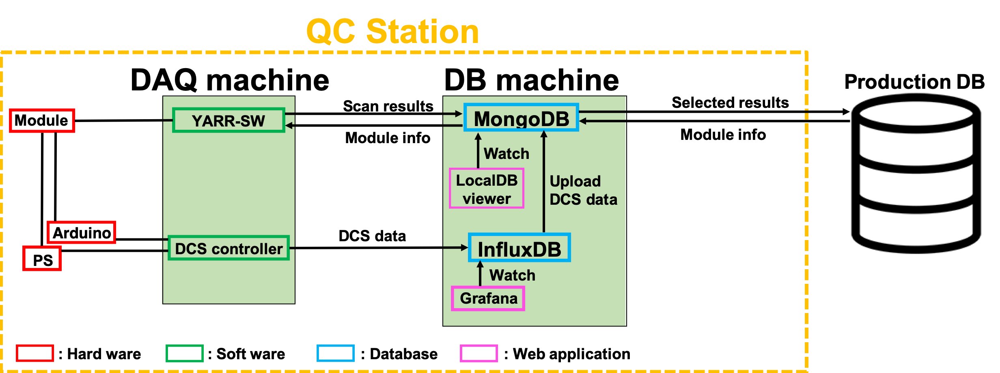

# QC Demonstration

## Structure of SW and DB

Production DB: A central DB for ITk,setup in Czech. 
MongoDB: A local DB to store module info, scan results and so on. 
InfluxDB: A DB dedicated for time series data to store DCS data.  
LocalDB viewer: A web application to see the contents of mongoDB. 
Grafana: A web application to see the contents of influxDB.  

In this tutorial, we suppose we have two machines, a DAQ machine and a DB machine in this tutorial. 
The DAQ machine is the local machine you use in the room.  
Run YARR-SW and DCS controller. Get scan results and DCS data in this machine and send the obtained data to the DB machine. 
The DB machine is a virtual remote machine which store the scan and DCS data. 
MongoDB, InfluxDB and some related services are provided.  
First, we create the environment for the QC tutorial to install the DB and SW for both machines. Then we demonstrate QC procedure according to the tutorial bellow. 

## Tutorial
In this QC demonstration, we can learn the follow things:

### Installation for DB machine
1. [Installation](database_demonstration_install_db_machine.md) 
2. [Setting for MongoDB](database_demonstration_mongodb.md) 
3. [Setting for LocalDB viewer](database_demonstration_viewer.md) 

### Installation for DAQ machine
1. [Installation](database_demonstration_install_daq_machine.md) 

### QC Flow
1. [Download Module ID info](database_demonstration_download_itkpd.md) 
Download the module data into Local DB from Production DB.
2. [Hook up the module to the devices and Run the DCS controller](database_demonstration_run_dcs.md) 
Run the DCS controller and read/monitor values(environment temp,current,voltage)
3. [Check DCS data in Grafana](database_demonstration_grafana.md) 
Checking the data in Grafana
4. [scanConsole and tuning](database_demonstration_scanconsole.md) 
Run scanConsole and store the test data to Local DB
5. [Select and Upload results to the Production DB](database_demonstration_upload_itkpd.md) 
Upload the results to the Production DB

## Appendix

## Contact
Let me know if you have questions or comments. 
E-mail:hiroki.okuyama at cern.ch 
Mattermost:[https://mattermost.web.cern.ch/yarr/channels/localdb](https://mattermost.web.cern.ch/yarr/channels/localdb)
<!--

-->
