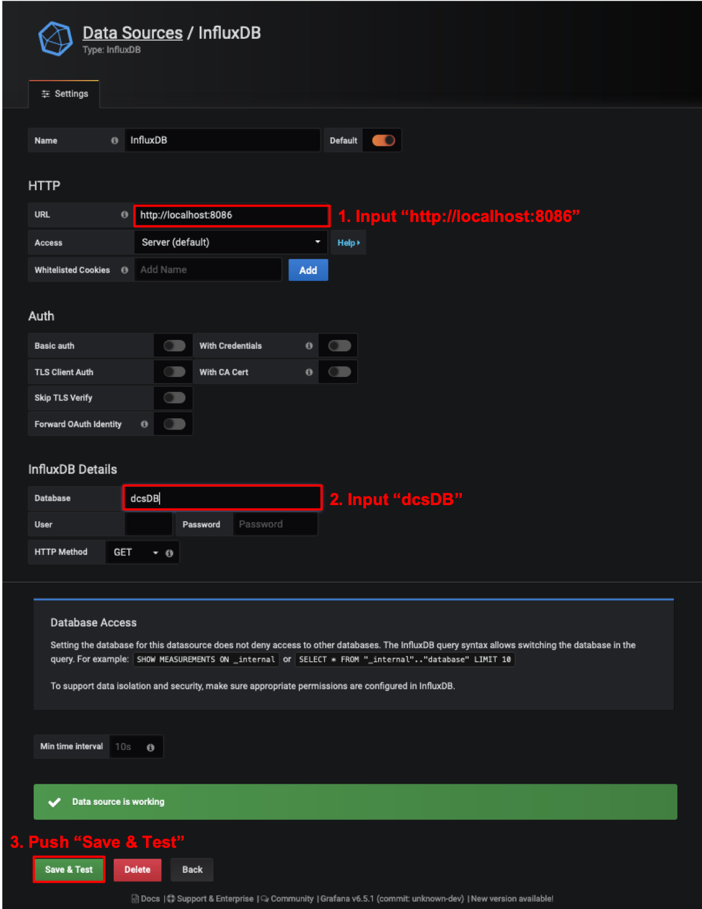
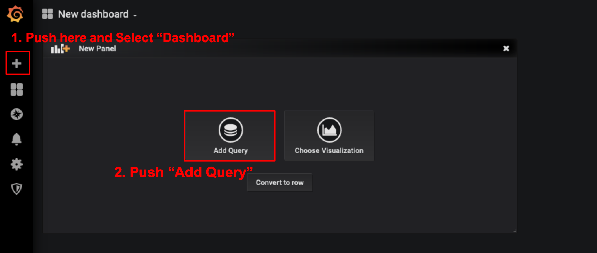
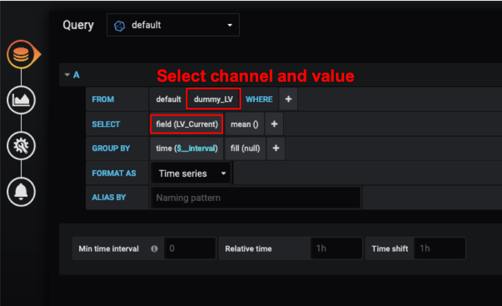

# grafana

### Create ssh tunnel 
To see grafana on your browser, Do the bellow comand on your command prompt.<br>
**Change the server name according to the given name** (e.g.:root@localdbserver1)<br> 
Password is the DB server account's password.(Default is "password".)

```bash
$ ssh -2 -C -Y -L 3000:localhost:3000 root@localdbserverX -fN
Password:
```

## Getting start

### 1. Access to the Web Page

Access to [http://127.0.0.1:3000/](http://127.0.0.1:3000/) with the machine's browser on the same network as DB machine,<br>
and you can see the web page as follows:


### 2. Login

Login with the username: 'admin' and the password: 'admin'


### 3. Add Database Source

1. Click "Add data source"
2. Click "InfluxDB"

<br>


3. Set URL "http://localhost:8086"
4. Set Database "dcsDB"
5. Click "Save & Test"



### 4. Create New Dashboard
Skip this step and return here after run DCS controller.

1. Click "+"
2. Click "Add Query"



3. Select the measurement channel (e.g. "Tempareture")
4. Select data value from the list (e.g. temp1)



Finish. Back to the previous page and go to next step.
