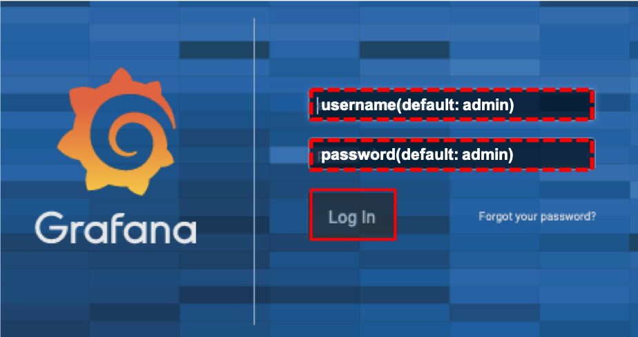

# grafana

## Goal

Check the graph of DCS data on your browser.

## Pre Requirements

### Grafana Server

You should check if the grafana service is running on the machine as follows:

```bash
$ grafana-server -v
Version 6.5.2 (commit: 742d165, branch: HEAD)
```

If the service doesn't seem to be running,<br>
maybe the package has not been installed or the service has not been started, <br>
so please check [pre requirement page](requirements.md) to install/start the service.

### DCS data

You should upload some dummy data into influxDB before checking the Grafana.<br>
Please check [influxDB page](database_demonstration_influxdb.md) to upload data.

## Getting start

### 1. Access to the Web Page

Access to [http://localhost:3000/](http://localhost:3000/) on the machine's browser where grafana was installed,<br>
and you can see the web page as follows:



### 2. Login

Login with the username: 'admin' and the password: 'admin'

### 3. Add Database Source

1. Click "Data Sources" in the Configuration in the side bar
2. Click "Add data source"


1. Set Name "dcsDB"
2. Set Type "influxDB"
3. Set URL "http://localhost:8086"
4. Set Database "dcsDB"
5. Click "Save & Test"


### 4. Create New Dashboard

1. Click "Dashboard" in the Create in the site bar
2. Click "Add panel"
3. Click "Graph"


1. Click "Panel Title"
2. Click "Edit" from the list
3. Select "dcsDB" for Data Source
4. Click "Add Query" and Select the measurement channel (e.g. "dummy_thermal")
5. Select data value from the list (e.g. 3_temperature)


Finish!

## More Detail

Check [Grafana site](https://grafana.com/docs/grafana/latest/guides/getting_started/) for more detail.
