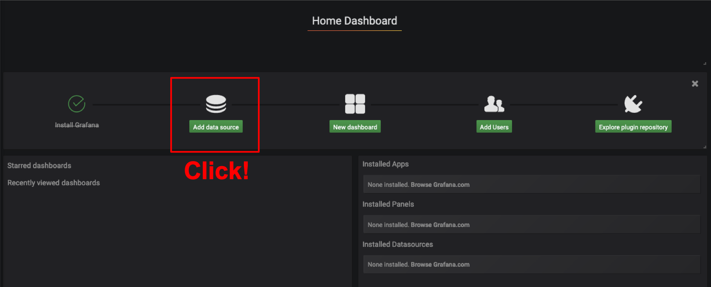

# grafana

## Pre Confirmation

You should check if the grafana service is running on the machine as follows:

```bash
$ grafana-server -v
Version 6.5.2 (commit: 742d165, branch: HEAD)
```

If the service doesn't seem to be running,<br>
maybe the package has not been installed or the service has not been started, <br>
so please check [pre requirement page](requirements.md) to install/start the service.

## Getting start

1. Access to [http://localhost:3000/](http://localhost:3000/) on the machine's browser where grafana was installed, and you can see the web page as follows:


2. Login with the username: 'admin' and the password: 'admin'

3. Add Database Sources





