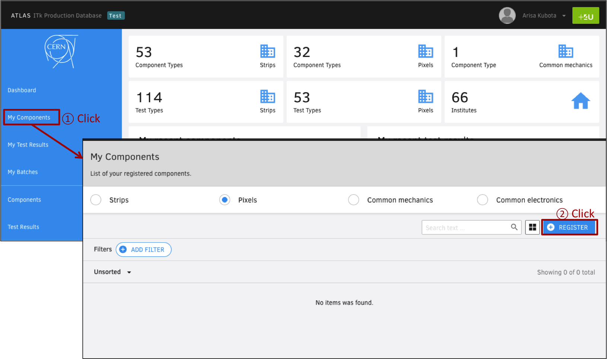
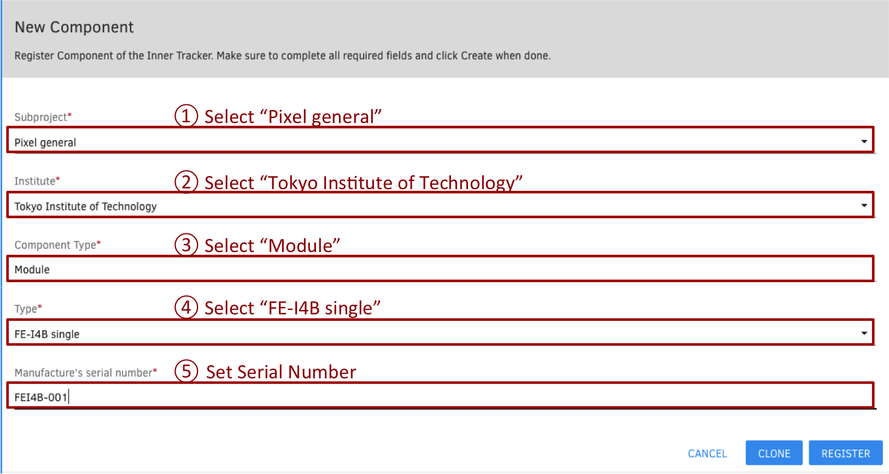
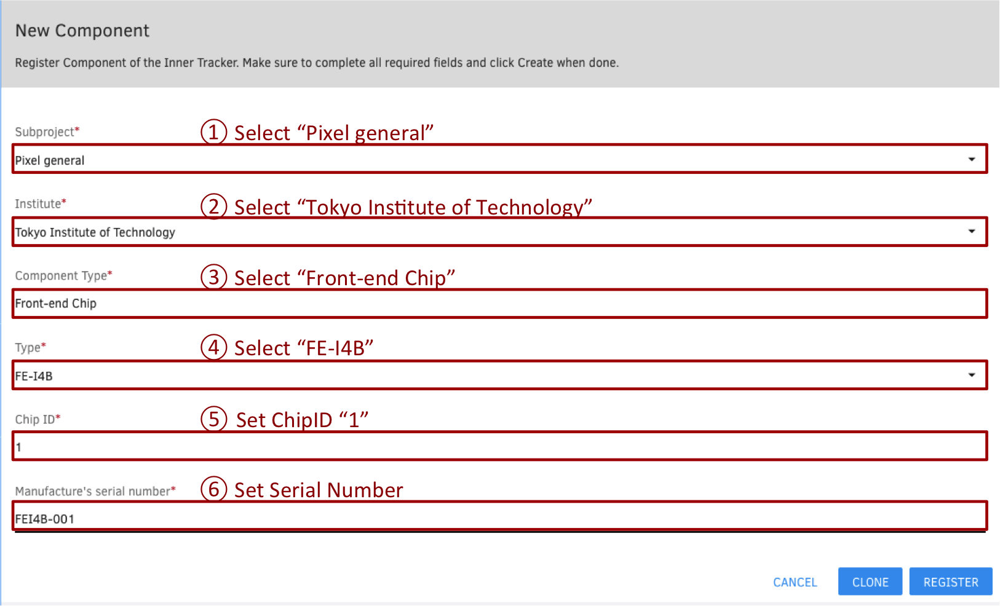
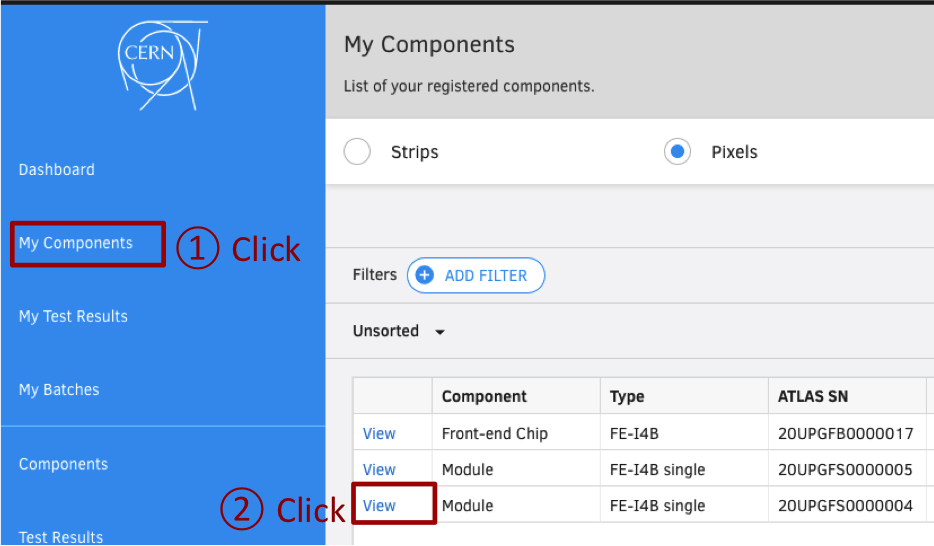
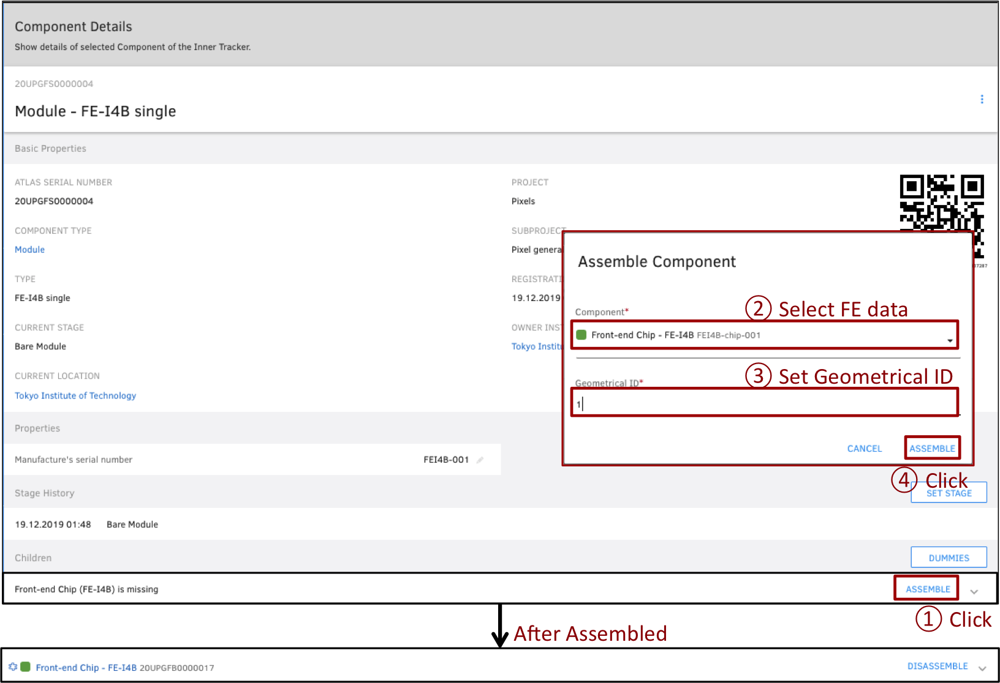

# Module Registration in ITkPD

## Goal

Register the component data (FE-I4B single module data & FE-I4B FE chip data for example).

## 1. Access ITkPD Web Page

Access [https://itkpd-test.unicorncollege.cz/](https://itkpd-test.unicorncollege.cz/) and login with your username & password.

## 2. Add New Component

1. Click "My Components" in the side bar.
2. Click "Register" to add new component into ITk PD.

## 3 Add Module Component

For example, try to register new FE-I4B single module.

1. Select "Pixel general" for Subproject.
2. Select "Tokyo Institute of Technology" for institute.
3. Select "Module" for Component Type.
4. Select "FE-I4B single" for Type.
5. Set Manufacture's Serial Number.

## 4. Add FE Component

For example, try to register new FE-I4B FE chip.

1. Select "Pixel general" for Subproject.
2. Select "Tokyo Institute of Technology" for institute.
3. Select "Front-end Chip" for Component Type.
4. Select "FE-I4B" for Type.
5. Set ChipID to "1".
6. Set Manufacture's Serial Number.

## 5. Assemble FE data into Module data

For example, try to assemble FE-I4B FE chip data into FE-I4B single module data.

1. Click "My Components" in the side bar.
2. Click "Viewer" to select the FE-I4B single module data from the list.

1. Click "ASSEMBLE" for children.
2. Select FE chip data for the assemble component data.
3. Set Geometrical ID to "1"
4. Click "ASSEMBLE" and the children data will be added.

Finish!
