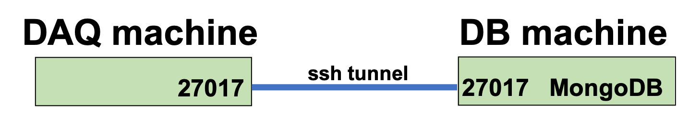
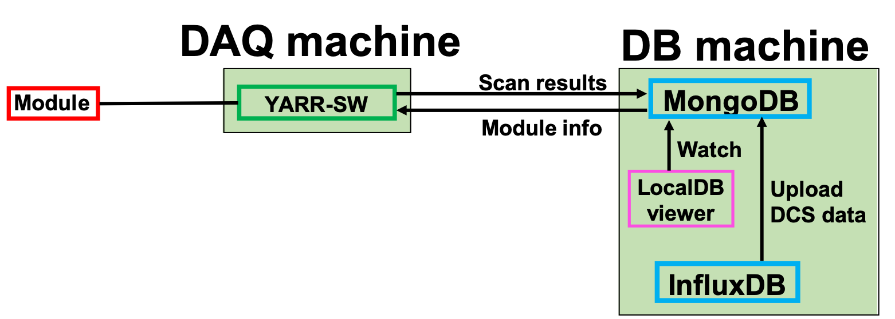

# Scan and tuning

### Create ssh tunnel 
In order to connect to the mongoDB in the DB machine from your local machine, Run the following comand on your shell.<br>
**Change the server name according to the given name** (e.g.:root@localdbserver1)<br> 
Password is the DB server account's password.(Default is "password".)

```bash
$ ssh -L 27017:localhost:27017 root@localdbserverX -fN -p22
Password:
```


### (a). Set username and password for mongodb 
Set username and password using the command bellow to connect to the mongoDB with authentication.<br>
Input LocalDB admin's username and password that you have set prebiously.
```bash
$ cd ~/work/YARR
$ source localdb/login_mongodb.sh
Input mongodb accounts username: 
Input mongodb accounts password: 
[LDB]Username and password are saved.
```

### (b). Setup database config
Set the config files using the following command to save the mongoDB's information.<br>
You don't have to change anything in this tutorial. Please answer "y" in all steps.
```bash
$ ./localdb/setup_db.sh
[LDB] Set editor command ...
[LDB] > emacs
[LDB]
[LDB] Checking Python Packages ...
[LDB]     ... OK!
[LDB]
[LDB] Checking Database Config: ...
[LDB]
[LDB] -----------------------
[LDB] --  Mongo DB Server  --
[LDB] -----------------------
[LDB] IP address       : 127.0.0.1
[LDB] port             : 27017
[LDB] database name    : localdb
[LDB] -----------------------
[LDB]
[LDB] Are you sure that is correct? (Move to edit mode when answer 'n') [y/n/exit]
[LDB] > y
...
[LDB] -----------------------
[LDB] --  User Information --
[LDB] -----------------------
[LDB] User Name        : 
[LDB] User Institution : 
[LDB] -----------------------
[LDB]
[LDB] Are you sure that is correct? (Move to edit mode when answer 'n') [y/n/exit]
[LDB] > y
...
[LDB] -----------------------
[LDB] --  Site Information --
[LDB] -----------------------
[LDB] site name        : 
[LDB] -----------------------
[LDB]
[LDB] Are you sure that is correct? (Move to edit mode when answer 'n') [y/n/exit]
[LDB] > y
...
[LDB]   Access 'https://localdb-docs.readthedocs.io/en/master/'
```

### (c). Create scan config files from mongodb
To create config files for scanConsole of YARR-SW, Run the command bellow.<br>
(We use the downloaded component's peoperty. Device's serial number is "20UPGRS0000009", chip's serial number is "20UPGRA0000026")
```bash
$ ./localdb/bin/localdbtool-retrieve pull --chip 20UPGRS0000009 
#DB WARNING# Not found test data of the component: 20UPGRS0000009
#DB INFO# component data ID: 5e30318ca13f8d000aa2a22b 
#DB INFO# - Parent    : 20UPGRS0000009 (module)
#DB INFO# - Chip Type : RD53A
#DB INFO# - Chips     : 20UPGRA0000026
#DB INFO# Retrieve ... ./db-data/20UPGRA0000026.json
#DB INFO# Retrieve ... ./db-data/connectivity.json
#DB INFO# -----------------------
```
The config files for the module are generated in 'db-data'.<br>

### (d). Change stage name in the scan config file
Edit the connectivity file(***db-data/connectivity.json***) and change stage name to "WIREBONDING".
```json
{
    "stage": "WIREBONDING",
    "chips": [
        {
            "config": "./db-data/20UPGRA0000026.json",
            "tx": 0,
            "rx": 0
        }
    ],
    "module": {
        "serialNumber": "20UPGRS0000009",
        "componentType": "module"
    },
    "chipType": "RD53A"
}
```

### (e). scanConsole and combine DCS data

Run scanConsole and run the scan using the following command.(e.g. digitalscan) 

```bash
$ ./bin/scanConsole -r configs/controller/specCfg.json -c db-data/connectivity.json -s configs/scans/rd53a/std_digitalscan.json -W
```
To include DCS data to the scan result, edit the DCS uploader config file (***localdb/configs/influxdb_connectivity.json***) as follows:
```json
{
    "environments" : [
        {
            "measurement" : "Temperature",
            "dcsList" : [
                {
                    "key"        : "temperature",
                    "data_name"  : "temp1",
                    "data_unit"  : "temp1_unit",
                    "description": "Room Temperature [C]",
                    "setting"    : 28
                },{
                    "key"        : "temperature",
                    "data_name"  : "temp2",
                    "data_unit"  : "temp2_unit",
                    "description": "Board Temperature [C]",
                    "setting"    : 28
                }
            ]
        },{
            "measurement" : "LV",
            "dcsList" : [
                {
                    "key"        : "vddd_voltage",
                    "data_name"  : "LV_Voltage",
                    "data_unit"  : "LV_Voltage_unit",
                    "description": "VDDD Voltage [V]",
                    "setting"    : 1.75
                },
                {
                    "key"        : "vddd_current",
                    "data_name"  : "LV_Current",
                    "data_unit"  : "LV_Current_unit",
                    "description": "VDDD Current [A]",
                    "setting"    : 1.1
                }
            ]
        }
    ]
}
```
Next, run the dbAccessor to upload the DCS data from influxDB to LocalDB:
```bash
$ ./bin/dbAccessor -F localdb/configs/influxdb_connectivity.json -n 20UPGRA0000026 -s data/last_scan/scanLog.json
```
Check the test result and DCS plot from following link [http://127.0.0.1:5000/localdb/scan](http://127.0.0.1:5000/localdb/scan).<br>



### (f). Tuning steps for QC
Test items for tuning are bellow:<br>
- diff_analogscan<br>
- diff_thresholdscan<br>
- diff_totscan<br>
- diff_tune_globalthreshold<br>
- diff_tune_pixelthreshold<br>
- diff_tune_globalpreamp<br>
- diff_retune_pixelthreshold<br>
- diff_tune_finepixelthreshold<br>
- diff_thresholdscan<br>
- diff_totscan<br>

Do this tuning step for the chip using the following commands as a module QC-minick.<br>
If you want to integrate the DCS data for each scan, put the following command between scans.<br>
"./bin/dbAccessor -F localdb/configs/influxdb_connectivity.json -n 20UPGRA0000026 -s data/last_scan/scanLog.json"

```bash
$ ./bin/scanConsole -r configs/controller/specCfg.json -c db-data/connectivity.json -s configs/scans/rd53a/diff_analogscan.json -W
$ ./bin/scanConsole -r configs/controller/specCfg.json -c db-data/connectivity.json -s configs/scans/rd53a/diff_thresholdscan.json -W
$ ./bin/scanConsole -r configs/controller/specCfg.json -c db-data/connectivity.json -s configs/scans/rd53a/diff_totscan.json -t 10000 -W
$ ./bin/scanConsole -r configs/controller/specCfg.json -c db-data/connectivity.json -s configs/scans/rd53a/diff_tune_globalthreshold.json -t 1500 -W
$ ./bin/scanConsole -r configs/controller/specCfg.json -c db-data/connectivity.json -s configs/scans/rd53a/diff_tune_pixelthreshold.json -t 1500 -W
$ ./bin/scanConsole -r configs/controller/specCfg.json -c db-data/connectivity.json -s configs/scans/rd53a/diff_tune_globalpreamp.json -t 10000 -W
$ ./bin/scanConsole -r configs/controller/specCfg.json -c db-data/connectivity.json -s configs/scans/rd53a/diff_retune_pixelthreshold.json -t 1500 -W
$ ./bin/scanConsole -r configs/controller/specCfg.json -c db-data/connectivity.json -s configs/scans/rd53a/diff_tune_finepixelthreshold.json -t 1500 -W
$ ./bin/scanConsole -r configs/controller/specCfg.json -c db-data/connectivity.json -s configs/scans/rd53a/diff_thresholdscan.json -W
$ ./bin/scanConsole -r configs/controller/specCfg.json -c db-data/connectivity.json -s configs/scans/rd53a/diff_totscan.json -t 10000 -W
```
Check the test results [http://127.0.0.1:5000/localdb/scan](http://127.0.0.1:5000/localdb/scan).<br>

Go to next step.<br>
[Select and Upload results into Production DB](database_demonstration_upload_itkpd.md)<br>

