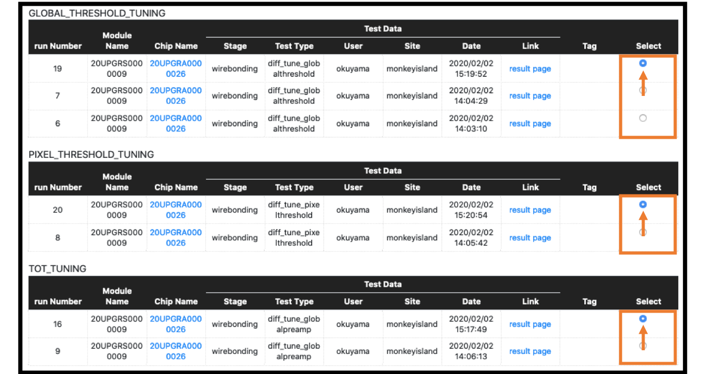
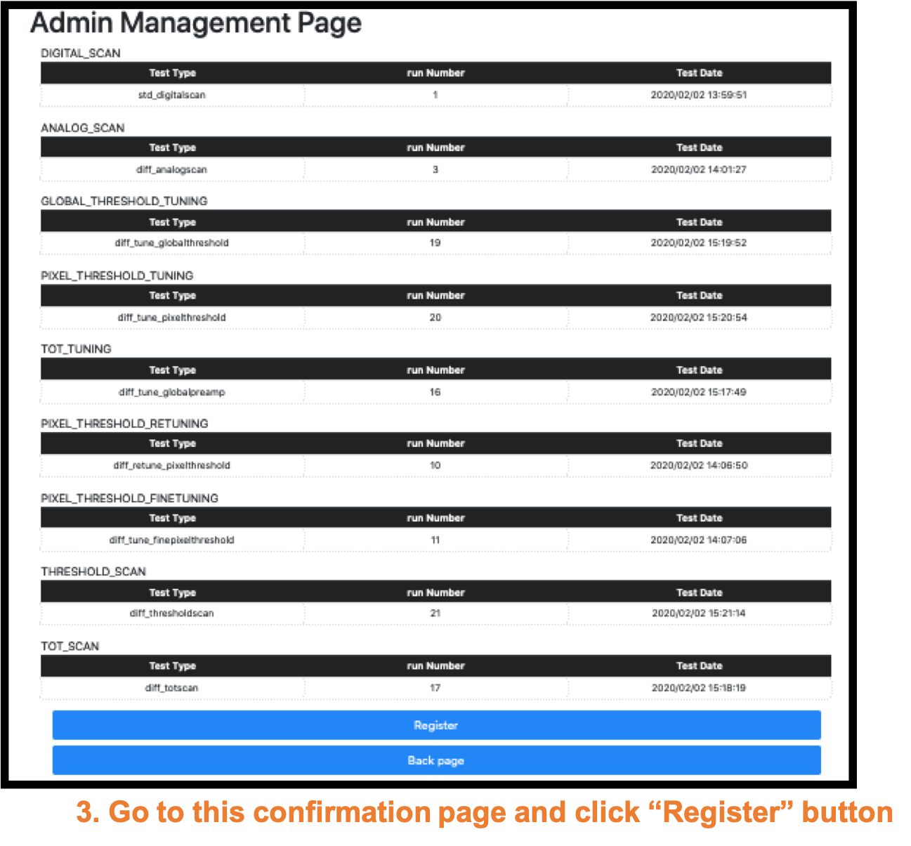
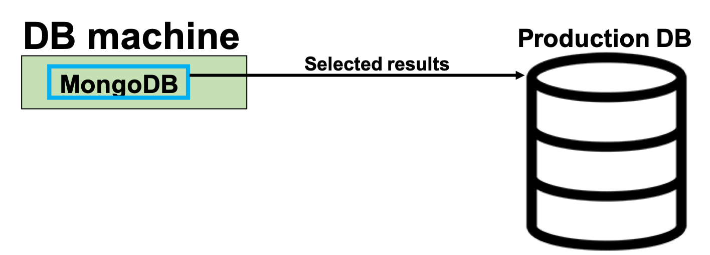

### Upload selected results to ITkPD.

Go to the selection page [http://127.0.0.1:5000/localdb/select_test](http://127.0.0.1:5000/localdb/select_test)  

**Input module name and stage at first.** 
**Module:"20UPGRS0000009"** 
**Stage:"WIREBONDING"**  

Go to the uploading page [http://127.0.0.1:5000/localdb/upload_result](http://127.0.0.1:5000/localdb/upload_result)

Finish this tutorial. Thank you for participating.
