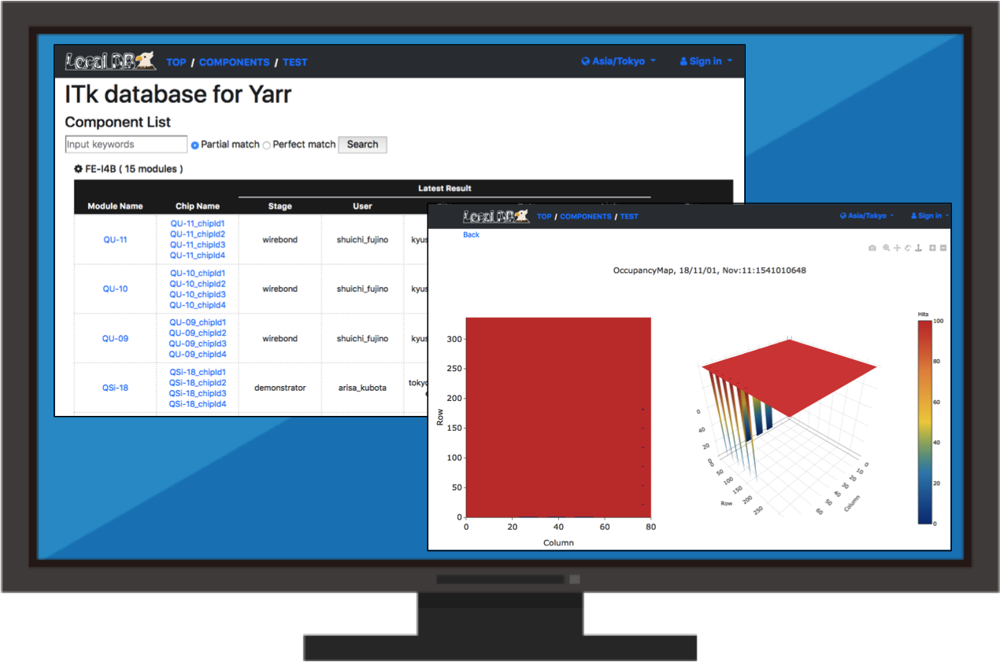
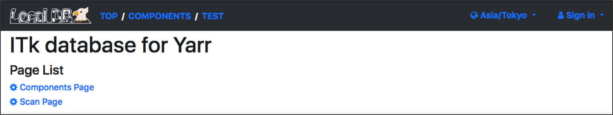

# Viewer Application

## Goal

Check the Web Page on your browser.



<!--
## Pre Requirements

Viewer Application is implemented in "Local DB Tools".<br>
You can install "Local DB Tools" as follows:

```bash
$ git clone -b devel https://gitlab.cern.ch/YARR/localdb-tools.git
```
-->
## Getting start

### 1. Setup Viewer Application by the script 'setup_viewer.sh'

In this step, you have to set the editor command (e.g. vim, emacs) if the environmental variable 'EDITOR' has not registered.

```bash
$ cd localdb-tools/viewer
$ ./setup_viewer.sh
[LDB] Set editor command ... > vim
[LDB]
[LDB] Welcome to Local Database Tools!
<some texts>
[LDB] More information: https://localdb-docs.readthedocs.io/en/master/
```

### 2. Start the application by the command 'app.py'

```bash
$ ./app.py --config admin_conf.yml
INFO Viewer Application URL: http://{IP Adress of DB machine}:5000/localdb/
 * Serving Flask app "app" (lazy loading)
 * Environment: production
```

### If you want to see the screen from your machine
If you want to see the grafana viewer on your browser of DAQ machine, you should execute the bellow comand on your machine.
```bash
$ ssh -2 -C -Y -L 5000:localhost:5000 {DB server IP} -fN
```

### 3. Access the Web Page

Access to [http://127.0.0.1:5000/localdb/](http://127.0.0.1:5000/localdb/) on your browser,<br>
and you can see the web page as follows:



Finish!

## More Detail

Check [Viewer Application Page](viewer.md) for more detail.
