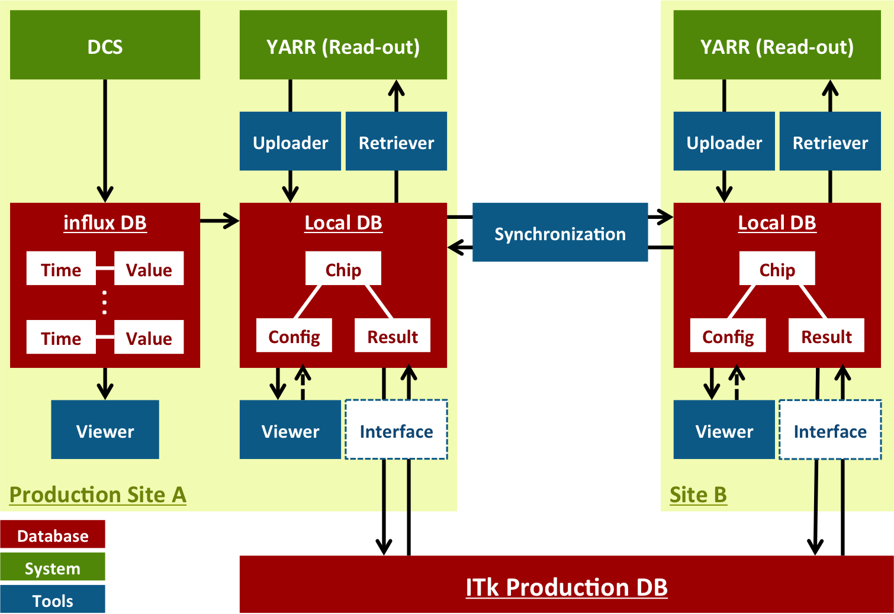
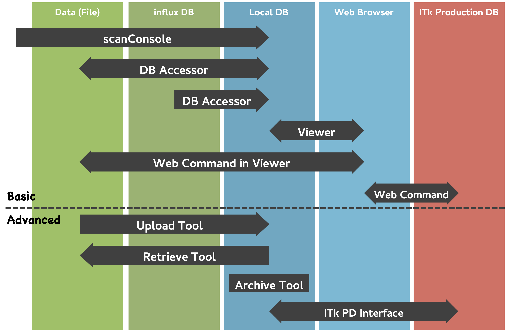

# Home


**Welcome to the Local DB Manual!**<br>
This manual introduces the overview of Local DB system, the installation, and provise samples of the usage and the configuration.

## What is Local DB?
**Local DB** (**Local Database**) is the data management/storage system based on [MongoDB](https://docs.mongodb.com/) for [YARR](https://gitlab.cern.ch/YARR).<br>
Using the tools for Local DB, you can:

- **Store** the test data associated with some information; chip, user, site ...
- **Retrieve** the config or result data into local directory
- **Check** the data on browser via web interface
- **Share/Centralize** the data with other Local DB
- **Upload/Download** the data to/from Production Database

## Local DB System



- YARR
    - [Git Repository](https://gitlab.cern.ch/YARR/YARR)
    - Folder Structure

```bash
YARR : Cloned from https://gitlab.cern.ch/YARR/YARR.git
|-- localdb
|   |-- setting                  : setup scripts and default config files dir
|   |-- bin                      : binary commands dir
|   |   |-- localdbtool-upload   : to upload data
|   |   `-- localdbtool-retrieve : to retrieve data
|   `-- lib                      : libaries dir
`-- bin                          : YARR read-out commands dir
    |-- scanConsole              : to execute scan
    `-- dbAccessor               : to handle database
```

- Local DB Tools
    - [Git Repository](https://gitlab.cern.ch/YARR/localdb-tools)
    - Folder Structure

```bash
localdb-tools : Cloned from https://gitlab.cern.ch/YARR/localdb-tools.git
|-- setting         : setup scripts dir
|-- viewer          : Viewer Application command & libraries
|-- sync-tool       : Synchronization Tool command & libraries
|-- archive-tool    : Archive Tool command & libraries
|-- itkpd-interface : ITkPD Interface command & libraries
|-- scripts         : Some scripts and default config files dir
`-- dev             : development dir
```
## Data Flow


