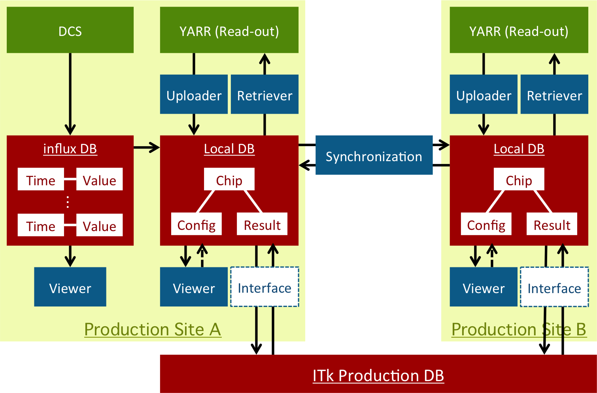

# Local DB: Local Database

## What is Local DB?
Local DB is the local data management/storage system based on [MongoDB](https://docs.mongodb.com/) for [YARR](https://gitlab.cern.ch/YARR).<br>
Using the tools for Local DB, you can:

- Store the test data associated with some information; chip, user, site ...
- Retrieve the config or result data into local directory
- Check the data on browser via web interface
- Share/Centralize the data with other Local DB
- Analysis the data and output the result data/plot
- Upload/Download the data to/from Production Database



## Local DB System

|Function      |Tool Name           |System        |Command                                                           |
|:------------:|:------------------:|:------------:|:----------------------------------------------------------------:|
|Storage System|Local DB            |MongoDB       |"mongodb installation dir"/bin/mongoi                           |
|Store Data    |Upload Tool         |YARR          |"YARR installation dir"/localdb/bin/localdbtool-upload          |
|Restore Data  |Retrieve Tool       |YARR          |"YARR installation dir"/localdb/bin/localdbtool-retrieve        |
|Share Data    |Synchronization Tool|Local DB Tools|"Tools installation dir"/sync-tool/bin/localdbtool-sync         |
|Check Data    |Viewer Application  |Local DB Tools|"Tools installation dir"/viewer/app.py                          |
|Archive DB    |Archive Tool        |Local DB Tools|"Tools installation dir"/archive-tool/bin/localdbtool-archive.sh|

## Contents
* [Requirements](requirements.md)
* [Quick Tutorial](tutorial.md)
* [Software Installation](install.md)

## Folder Structure
```bash
YARR : Cloned from https://gitlab.cern.ch/YARR/YARR.git
|-- localdb
|   |-- setting : setup scripts and default config files dir
|   |-- bin : binary commands dir
|   |   |-- localdbtool-upload : uploader
|   |   `-- localdbtool-retrieve : retriever
|   `-- lib : libaries dir
`-- bin : YARR read-out commands dir

localdb-tools : Cloned from https://gitlab.cern.ch/YARR/localdb-tools.git
|-- setting : setup scripts dir
|-- viewer : Viewer Application command & libraries
|-- sync-tool : Synchronization Tool command & libraries
|-- archive-tool : Archive Tool command & libraries
|-- scripts : Some scripts and default config files dir
`-- dev : development dir
```

## Contact

|Role|Name|Institution|E-mail|
|:--|:--|:--|:--|
|Developer|Alisa Kubota|[Tokyo Institute of Technology](http://www-hep.phys.titech.ac.jp/jlab/index_e.html)|arisa.kubota(at)cern.ch|
|Developer|Hiroki Okuyama|[Tokyo Institute of Technology](http://www-hep.phys.titech.ac.jp/jlab/index_e.html)|hiroki.okuyama(at)cern.ch|
|Developer|Eunchong Kim|[Tokyo Institute of Technology](http://www-hep.phys.titech.ac.jp/jlab/index_e.html)|eunchong.kim(at)cern.ch|
|Developer|Hideyuki Oide|[Tokyo Institute of Technology](http://www-hep.phys.titech.ac.jp/jlab/index_e.html)|hideyuki.oide(at)cern.ch|
