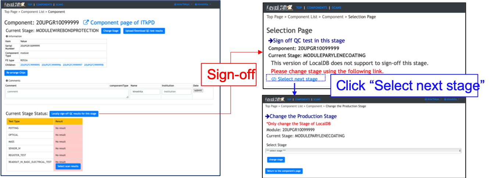

[Tutorial's Top page](flow.md) 
[Previous step](signoffbare.md) 

# Change a stage after Wirebonding

Cuurent LocalDB does not support stages after Wirebonding.

For practice, LocalDB can change the stage without sign-off so that we can upload scans results and QC results for each stage.

Finish this tutorial! 
[Tutorial's Top page](flow.md) 
