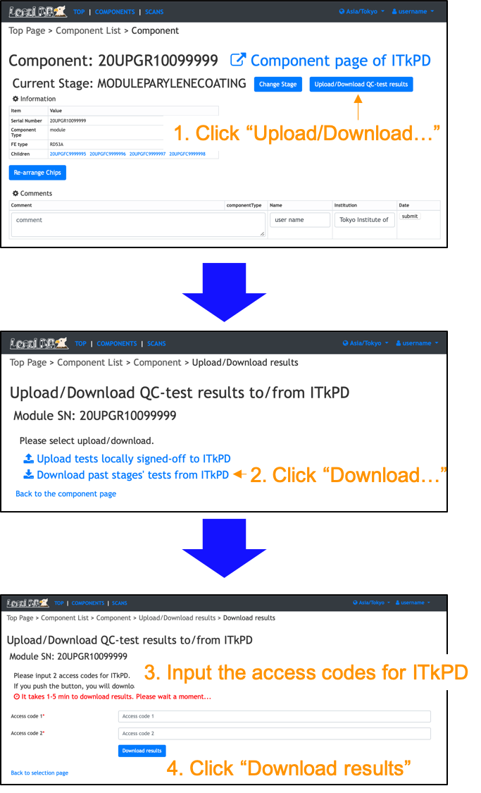

[Tutorial's Top page](flow.md)<br>
[Previous step](upload_itkpdbare.md)<br>
<hr>

# Download QC-test results from ITkPD

For this tutorial, we use a module: `ATLAS SN: 20UPGXM0000002`. We prepared this module as the target to download results.<br>
[Component Page for 20UPGXM0000002](https://uuappg01-eu-w-1.plus4u.net/ucl-itkpd-maing01/dcb3f6d1f130482581ba1e7bbe34413c/componentView?code=453953baba941fff9dbe41c6c9b6a0fe)

## Download a module information from ITkPD

We need to download a module information from ITkPD. We will download a module using commands below:
```bash
$ cd ~/localdb-tools/viewer/itkpd-interface
$ source authenticate.sh
Input Access Code 1 for ITkPD:
Input Access Code 2 for ITkPD:
You have signed in as Satoshi Kinoshita. Your token expires in 1799s.
$ ./bin/ModuleIdDownloader.py --component_id 20UPGXM0000002
```
Then, we can see a module in LocalDB viewer:<br>
[http://localhost:5000/localdb/components](http://localhost:5000/localdb/components)<br>
or<br>
http://IPADRESS:5000/localdb/components


## Download results from ITkPD

You can download QC test results stored in ITkPD.
<br>
Please follow the instruction below after sign-in on your viewer to click "Sign-in" at the top left conner.<br>
<br>


After downloading results, you can see QC-test results on the LocalDB viewer!

Go to next step.<br>
[Upload QC-test results for Wirebonding](nonelectricalwire.md)<br>
