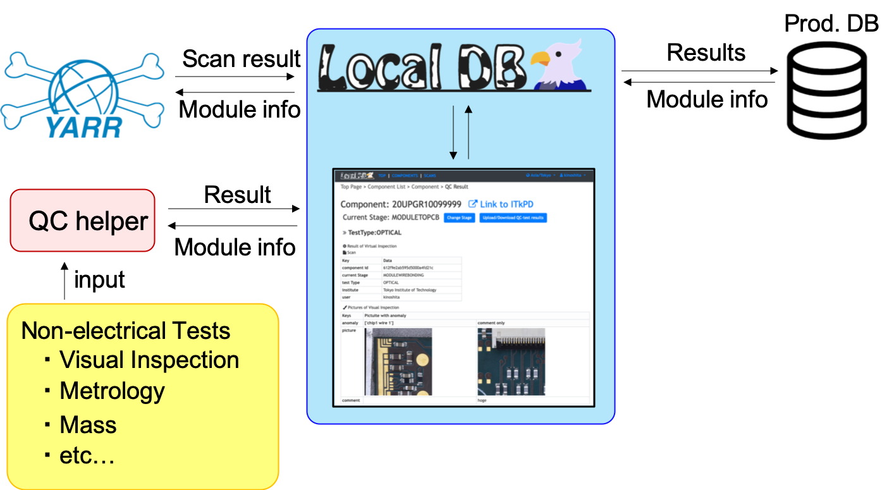

# QC Demonstration with LocalDB (version 1.6)

## Structure of SW and DB

* `Production DB`: A central DB for ITk,setup in Czech.
* `LocalDB viewer`: A web application to manage module QC.
* `QC-helper`: A GUI to upload non-electrical test.

In this tutorial, we suppose we have three SWs: localdb-tools, QC-helper and YARR.
The DAQ machine is the local machine and you take scan data with YARR emulator.

The DB machine is a local or virtual remote machine which store the scan and DCS data where MongoDB and other relevant services are provided.

We will use `tutorial components` for this tutorial. Before starting this tutorial, we will assign the ATLAS SNs for some components.

Please input your name in this spreadsheet:
[https://docs.google.com/spreadsheets/d/1OqOUhGu_tBYJXXhzD7B5GtiS1nLSQiVCOWlQe9BCIIM/edit?usp=sharing](https://docs.google.com/spreadsheets/d/1OqOUhGu_tBYJXXhzD7B5GtiS1nLSQiVCOWlQe9BCIIM/edit?usp=sharing)

First, we confirm SW versions we installed:

|Software  |Version      |Link       |
|:-------:|:------------:|:---------:|
|LocalDB tools|ldbtoolv1.6   |[Git](https://gitlab.cern.ch/YARR/localdb-tools/-/tree/ldbtoolv1.6.0)   |
|QC-helper|v2.4.3  |[Git](https://gitlab.cern.ch/YARR/localdb-tools/-/tree/ldbtoolv1.6.0)    |
|YARR   |v1.3   |[Git](https://gitlab.cern.ch/YARR/YARR/tree/master)    |

Then we demonstrate the QC procedure following the tutorial bellow.

## Tutorial
In this QC demonstration, we can learn the following things:

### 1. Set up LocalDB
* [Setting for MongoDB](mongodb.md)
* [Setting for LocalDB](viewer.md)

### 2. Register a New Module to DB
* [Register Children(PCB, sensor, chip, carrier) to ITkPD](register_children.md)
* [Register a New Bare Module to ITkPD](register_bare.md)
* [Register a new Module to DB](register_module.md)

### 3. Upload QC-test results for Bare to PCB
* [Upload QC-test results for Bare to PCB](nonelectricalbare.md)

### 4. Sign-off and Upload test results to ITkPD
* [Sign-off each stage](signoffbare.md)
* [Push the list of signed off results](upload_itkpdbare.md)

### 5. Upload QC-test results for Wirebonding
* [Upload QC-test results for Wirebonding](nonelectricalwire.md)
* [Upload Scan results to LocalDB](scanconsole.md)
* [Select Scans test results](upload_resultwire.md)

### 6. Sign-off each stage and push results to ITkPD
* [Sign-off each stage](signoffwire.md)
* [Push the list of signed off results](upload_itkpdwire.md)
* [Pull the list of QC test results](download_results.md)

### 6. Change a stage after Wirebonding
* [Change a stage after Wirebonding](change_stage.md)

## Reference

1. Document of "Traveling module"[(https://moduledaqdb.readthedocs.io/en/latest/)](https://moduledaqdb.readthedocs.io/en/latest/)
2. Yarr docs[(https://yarr.readthedocs.io/en/latest/)](https://yarr.readthedocs.io/en/latest/)
3. LocalDB docs[(https://localdb-docs.readthedocs.io/en/master/)](https://localdb-docs.readthedocs.io/en/master/)
4. QC-helper docs[(https://grafana.com)](https://grafana.com)
5. Tutorial page for ITk production DB[(https://gitlab.cern.ch/jpearkes/itkpd_tutorial/blob/master/README.md)](https://gitlab.cern.ch/jpearkes/itkpd_tutorial/blob/master/README.md)
6. Module QC documentation[(https://cds.cern.ch/record/2702738/files/ATL-COM-ITK-2019-045.pdf?)](https://cds.cern.ch/record/2702738/files/ATL-COM-ITK-2019-045.pdf?)
7. MongoDB web[(https://www.mongodb.com)](https://www.mongodb.com)

## Contact

* Please send questions or comments to: kinoshita at hep.phys.titech.ac.jp
* Also a dedicated mattermost channel:[https://mattermost.web.cern.ch/yarr/channels/qc-demonstration](https://mattermost.web.cern.ch/yarr/channels/qc-demonstration)
