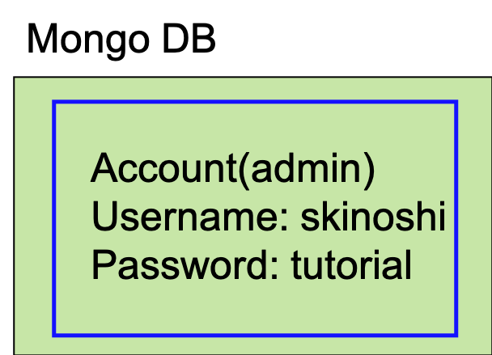

[Tutorial Top page](flow.md)<br>
<hr>

# MongoDB

## Create accounts in mongoDB
Create an account in mongoDB using the following commands.<br>
Input "username" and "password" as you like.(e.g.: USERNAME=skinoshi, PASSWORD=tutorial)<br>
<span style="color: red; ">**These are used as LocalDB admin's username and password.**</span>

```bash
$ cd ~/work/localdb-tools/setting
$ ./create_admin.sh
Authentication succeeded!
Local DB Server IP address: 127.0.0.1
Local DB Server port: 27017

Are you sure thats correct? [y/n]
> y

Register localDB admins username: USERNAME
Register localDB admins password:
Successfully added user:
...
For checking the setting of Local DB: /etc/mongod.conf
```


Now the mongoDB setup is done!!<br>


Go to next step.<br>
[Setting for LocalDB viewer](viewer.md)<br>
