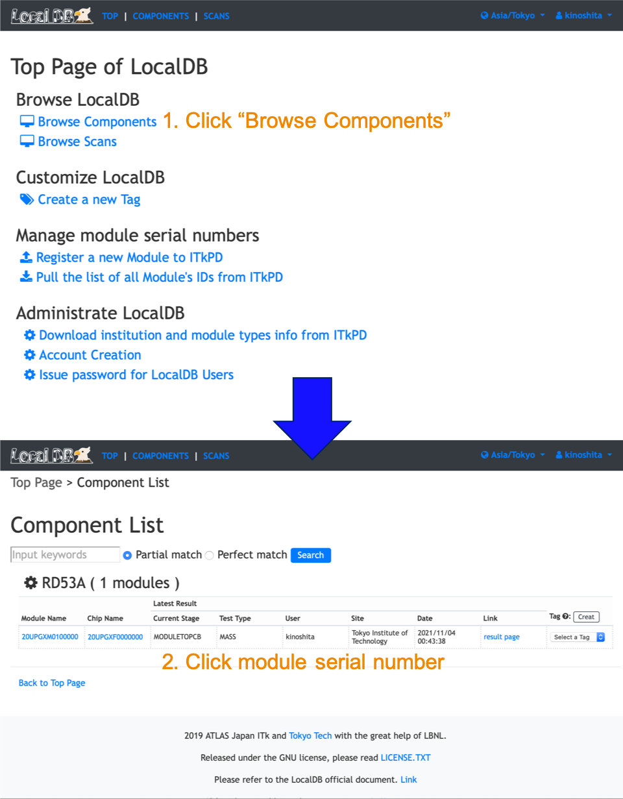

[Tutorial's Top page](flow.md)<br>
[Previous step](register_module.md)<br>
<hr>

# Upload QC-test results for Bare to PCB

We will upload QC-test results using GUI for QC-helper. QC-helper cafully support operations.<br>
If you check the detail for QC-helper, please check it: [Instruction for QC-helper](https://gitlab.cern.ch/atlas-itk/sw/db/pixels/qc-viz-tools-dev/qc-helper/-/tree/master/doc/Instruction)

## Test Items for Bare to PCB


### Bare to PCB
- Visual Inspection
- Metrology (<span style="color: red; ">Old format</span>)
- Mass
- Glue Flex Attach infomation

!!! Warning
    Stages and test items are not current version. We are improving the SW to match newest version of QC flow.<br>


## QC-helper
QCHelper is GUI to upload QC results to localDB.

!!! Warning
    Before stating to upload QC results, you need to pull the reference module's picture in `WorkDir/qc-helper/each_test/qc-vi`. Please confirm before stating GUI for QC-helper.<br>


### 1. Start GUI

```bash
$ cd Workdir/qc-helper
$ python3 main.py
```
<br>

### 2. Operating procedure


<br>

When we are asked to input some file, please use the files we downloaded from [indico](https://indico.cern.ch/event/1093086/).

Most of the results are easy to input, but visual inspection is a little complicated. If you are confusing for visual inspection, please check below:


#### Optical Inspection (Visual Inspection)


### 3. Check the uploaded results in LocalDB viewer

We can see the uploaded results in LocalDB viewer:<br>
[http://127.0.0.1:5000/localdb](http://127.0.0.1:5000/localdb)<br>
or <br>
https://IPADRESS:5000/localdb.

#### Go to the module's toppage following the instruction below.


You can see the uploaded results in the table of "QC Test" in the page as below.
You can go to the result page for each test by clicking the ids in the table.


After uploading all required test results to LocalDB, we can proceed a stage.

Go to next step.<br>
[Sign-off Bare to PBC](signoffbare.md)<br>
