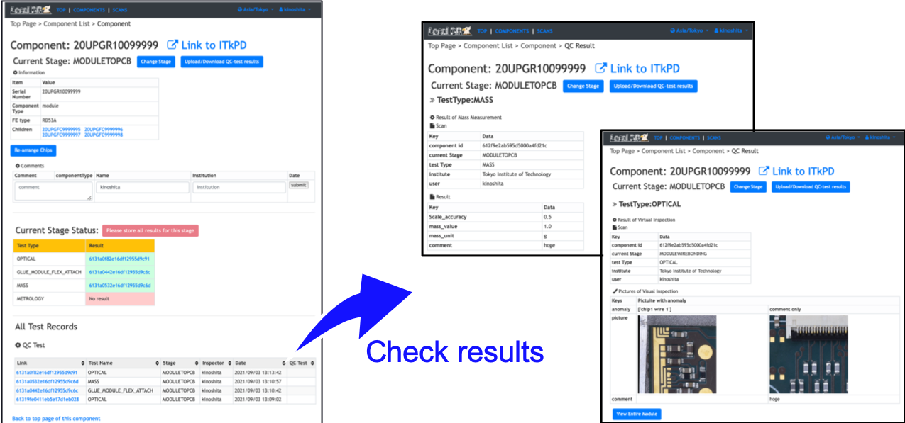

[Tutorial's Top page](flow.md)<br>
[Previous step](upload_itkpdbare.md)<br>
<hr>

# Upload QC-test results for Wirebonding

We will upload non-electrical test results using GUI for QC-helper and upload scans results using YARR.<br>
In addition to upload QC-test results, we will update module properties on Wirebonding. We can update using QC-helper.

## Test Items for Wirebonding


### Wirebonding
- Visual Inspection
- Wirebond info
- Wirebond pull test
- Sensor IV
- SLDO VI
- Pixel Failure Test (Full Electrical Test)
### Module Properties
- RD53A pull-up register
- IrefTrim for each FE
- PCB-Bare Orientation


## QC-helper

### 1. Start GUI

```bash
$ cd Workdir/qc-helper
$ python3 main.py
```
<br>

### 2. Operating procedure


<br>

### 3. Check the uploaded results in LocalDB viewer

We can see the uploaded results in LocalDB viewer:<br>
[http://127.0.0.1:5000/localdb](http://127.0.0.1:5000/localdb)<br>
or <br>
https://IPADRESS:5000/localdb.


#### Go to the module's toppage following the instruction below.


You can see the uploaded results in the table of "QC Test" in the page as below.
You can go to the result page for each test by clicking the ids in the table.



<br>

Next, we will upload scans results using the YARR emulator scanConsole.

Go to next step.<br>
[Upload Scan results to LocalDB](scanconsole.md)<br>
