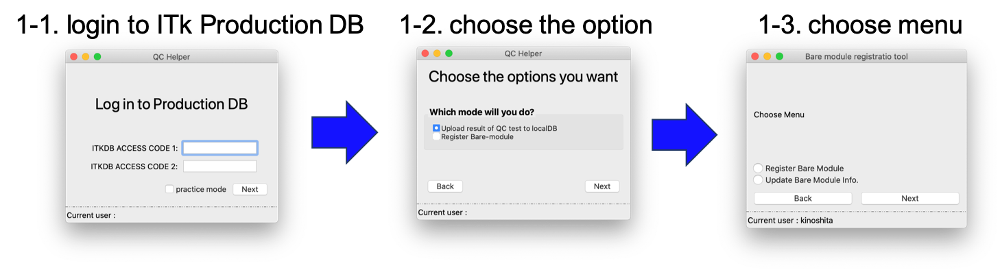
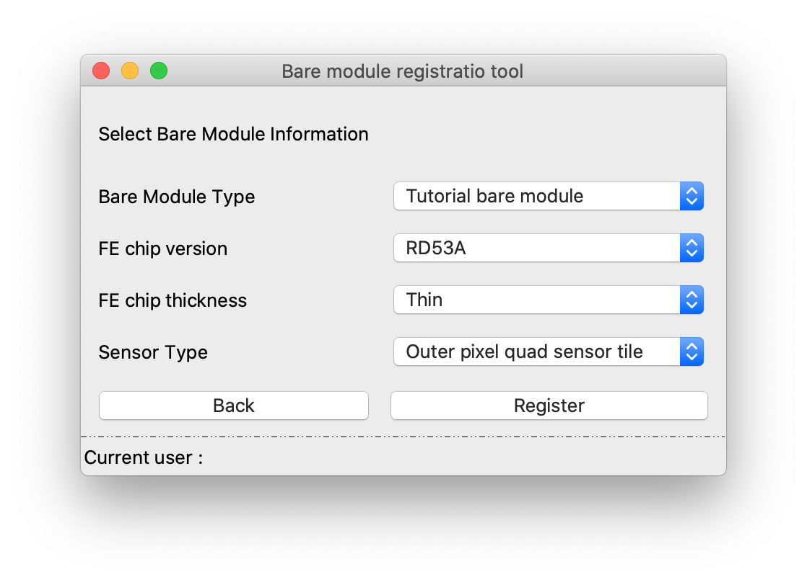

[Tutorial's Top page](flow.md) 
[Previous step](register_children.md) 

# Register a new bare module to ITkPD

User can register a bare-module and assemble FE chips and seonsor tiles to the registered bare-module. The way to register is following:

1. Choose the option to `Register Bare Module`

The first, we log in to ITkPD.
If you don't have an account for the production DB. Please sign up following the link below: 
[Tutorial page for ITkPD ](https://gitlab.cern.ch/jpearkes/itkpd_tutorial/blob/master/README.md) 

2. Input bare module information

3. Assemble `chip` and `sensor tile` to the `bare module`

After registering a bare module to ITkPD, we can register a new module to ITkPD.

Go to next step. 
[Register a New Module to ITkPD](register_module.md) 
