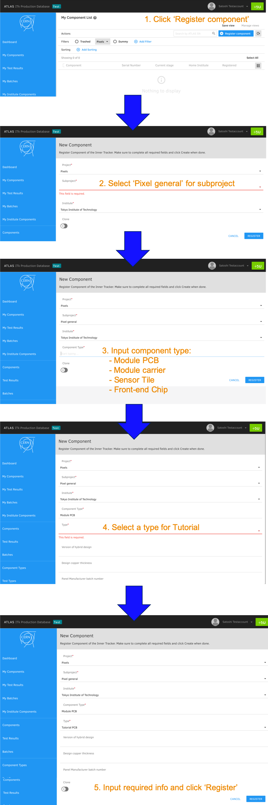

[Tutorial's Top page](flow.md) 
[Previous step](viewer.md) 

# Register new components with ITkPD

For this tutorial, we use `tutorial components`. These components does not collide with the real modules.

We can register a module from LocalDB and a bare module from QC-helper. Before registering these components, we need to register children for these. We will register components using web page for [ITkPD](https://itkpd-test.unicorncollege.cz/myComponents). We can register a new component from `My Components`:

[https://itkpd-test.unicorncollege.cz/myComponents](https://itkpd-test.unicorncollege.cz/myComponents)

 

## Required Parameters

### Module PCB
  - FE chip version: `RD53A`
  - Thickness: `Thin`
  - ATLAS SN: Check [Spreadsheet](https://docs.google.com/spreadsheets/d/1OqOUhGu_tBYJXXhzD7B5GtiS1nLSQiVCOWlQe9BCIIM/edit?usp=sharing)

### Module carrier
  - Module Carrier Type: 0
  - Usage countdown: 1
  - ATLAS SN: Check [Spreadsheet](https://docs.google.com/spreadsheets/d/1OqOUhGu_tBYJXXhzD7B5GtiS1nLSQiVCOWlQe9BCIIM/edit?usp=sharing)

### Front-end Chip
  - ATLAS SN: Check [Spreadsheet](https://docs.google.com/spreadsheets/d/1OqOUhGu_tBYJXXhzD7B5GtiS1nLSQiVCOWlQe9BCIIM/edit?usp=sharing)

### Sensor Tile
  - Main vendor: 0
  - Sensor Type or Test Structure: 0
  - Manufactuer serial number: Check [Spreadsheet](https://docs.google.com/spreadsheets/d/1OqOUhGu_tBYJXXhzD7B5GtiS1nLSQiVCOWlQe9BCIIM/edit?usp=sharing)
  - Version of component: prototype

 
After registering children, we can register a new bare module and module to DB!

Go to next step. 
[Register a new Bare Module to ITkPD](register_bare.md) 
