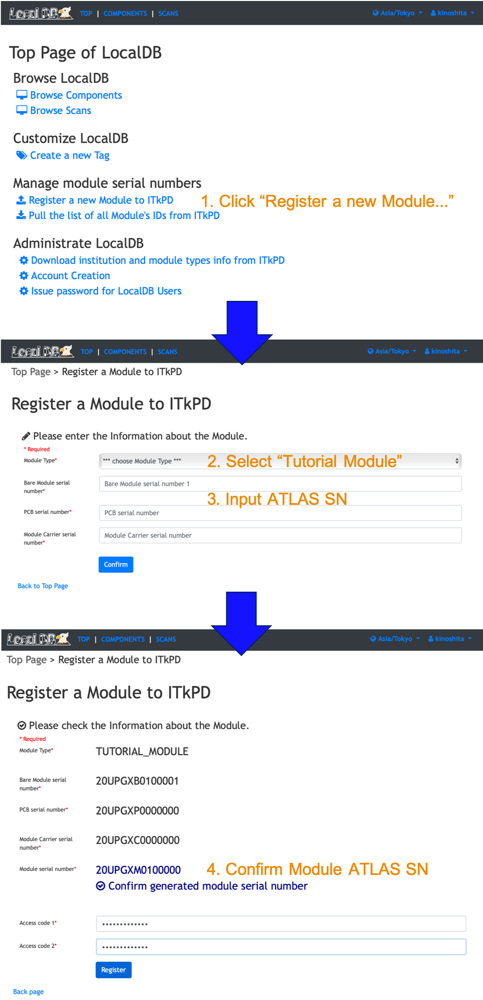

[Tutorial's Top page](flow.md) 
[Previous step](register_bare.md) 

# Register a new module to DB

We can register a new module using web page of LocalDB. It register a module to ITkPD and LocalDB. 
If you don't have an account for the production DB. Please sign up following the link below. 

Please go to the top page in LocalDB and follow the instruction below.
 

 
You can check the registered module list in the page of the production DB below. You can go to the page by the following link: 

[https://itkpd-test.unicorncollege.cz/myComponents](https://itkpd-test.unicorncollege.cz/myComponents) 

You can find the registered module list in the page of the LocalDB.
[http://localhost:5000/localdb/components](http://localhost:5000/localdb/components) 

You can start QC tests for the registered module. 

 
Go to next step. 

[Register Children(PCB, chip, sensor, carrier) to ITkPD](nonelectricalbare.md) 
