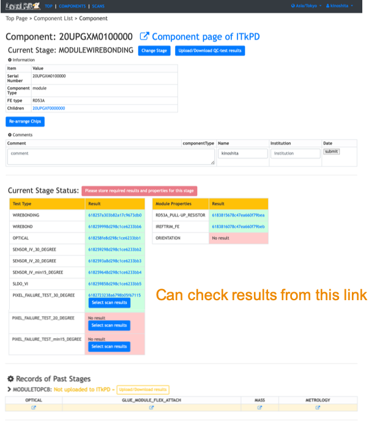

# Sign-off each stage

## 1. Select Scan Results
Need to select scans and register those as QC results for an electrical test of this stage.
We are currently supporting the follwing test types and need to select the scans for each item:
- PIXEL_FAILURE_TEST
  - std_digitalscan
  - std_analogscan
  - std_thresholdscan
  - std_totscan
  - std_noisescan
  - std_crosstalk_scan
- READOUT_IN_BASIC_ELECTRICAL_TEST
  - std_digitalscan
  - std_analogscan
  - std_thresholdscan
  - std_totscan
  - std_discbumpscan.json

### 1-1. Select and Register scans for QC results of electrical tests for this stage

Please follow the instruction below after sign-in on your viewer to click "Sign-in" at the top left conner.

### 1-2. View the selected results in LocalDB viewer
You can check the selected scans as QC results on the top page of the module in LocalDB viewer.

## 2. Sign-Off Results

Need to sign off the QC results to select test results for each QC test items in the viewer.
The production stage is automatically changed to the next after the sign-off.
Please follow the instruction below after sign-in on your viewer to click "Sign-in" at the top left conner.

After the sign-off, you can check the results signed off and the stage of the module go to next in the module's top page.

Go to next step. 
[Push signed off QC test results into ITkPD](upload_itkpd.md) 
