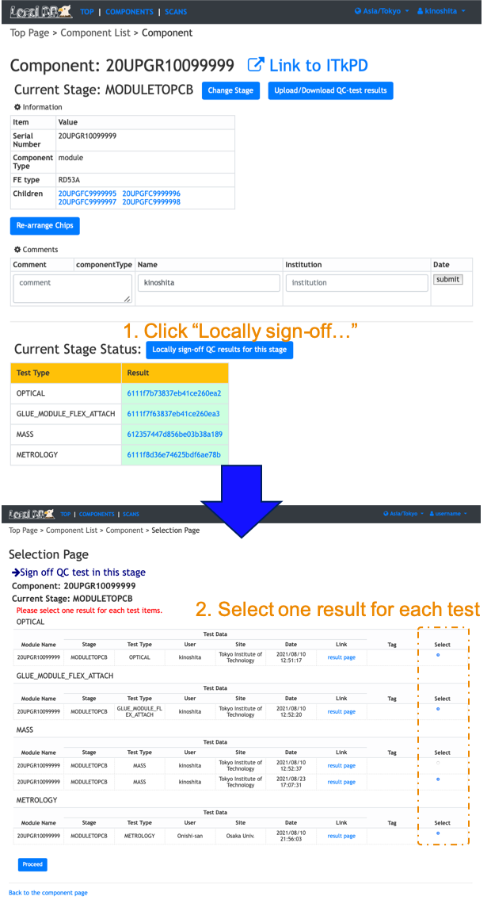

[Tutorial's Top page](flow.md) 
[Previous step](noelectricalbare.md) 

# Sign-off each stage

Need to sign off the QC results to select test results for each QC test items in the viewer.
The production stage is automatically changed to the next after the sign-off.
Please follow the instruction below after sign-in on your viewer to click "Sign-in" at the top left conner.

After the sign-off, you can check the results signed off and the stage of the module go to next in the module's top page.

Go to next step. 
[Push signed off QC test results into ITkPD](upload_itkpdbare.md) 
