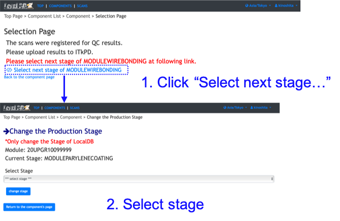

[Tutorial's Top page](flow.md) 
[Previous step](upload_resultwire.md) 

# Sign-off each stage

## Sign-Off Wirebonding

We will sign off the QC results to select test results for each QC test items in the viewer.
The next stage of Wirebonding depends on production site. So we will select the next stage of Wirebonding.
Please follow the instruction below after sign-in on your viewer to click "Sign-in" at the top left conner.

 

After the sign-off Wirebonding, we need to select next stage of Wirebonding:

 

After the sign-off, we will upload the selected results to ITkPD.

Go to next step. 
[Push signed off QC test results to ITkPD](upload_itkpdwire.md) 
