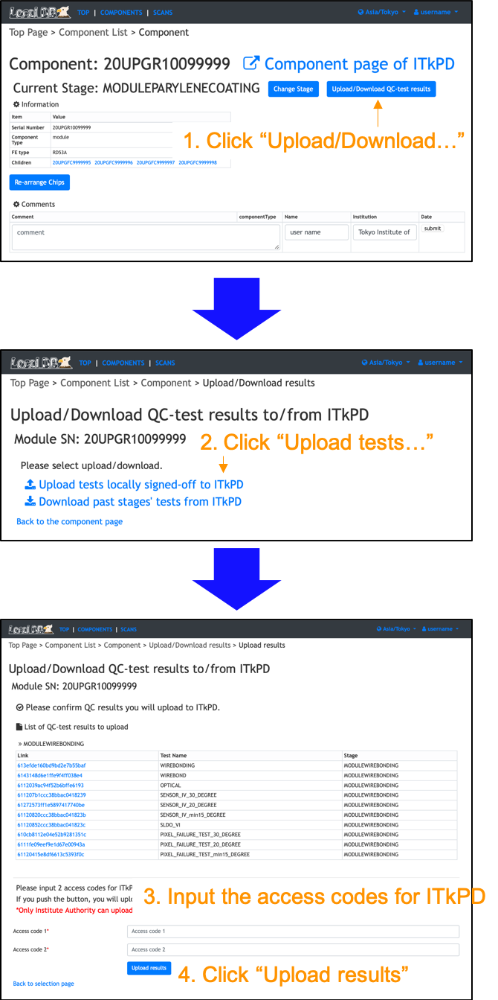
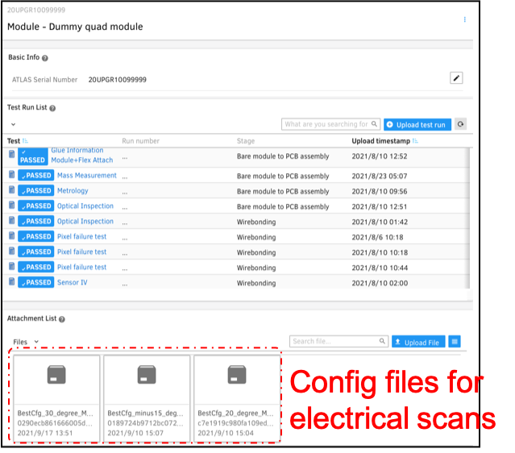

[Tutorial's Top page](flow.md) 
[Previous step](signoffwire.md) 

# Upload selected results to ITkPD

You can upload selected QC test results to ITkPD. 
Please follow the instruction below after sign-in on your viewer to click "Sign-in" at the top left conner. 
 

You can check the resutls at web page for ITkPD:

[https://itkpd-test.unicorncollege.cz/myTests](https://itkpd-test.unicorncollege.cz/myTests)

At Wirebonding, we will upload results for Pixel Failure Tests(Full Electrical Tests). So LocalDB will attach scan config files to a module:

### Config Zip: `BestCfg_<temp>_degree_<stage_name>.zip`
- Chip config files (json file)

We developed a tool to download `BestCfg_<temp>_degree_<stage_name>.zip` from ITkPD: [Git](https://gitlab.cern.ch/hirose/ModuleConfigDownloader) 
Using config files, we can upload scan results for a module at the reception site.

 
Next, I show how to download QC-test results from ITkPD.

Go to next step. 
[Pull the list of QC test results from ITkPD](download_results.md) 
