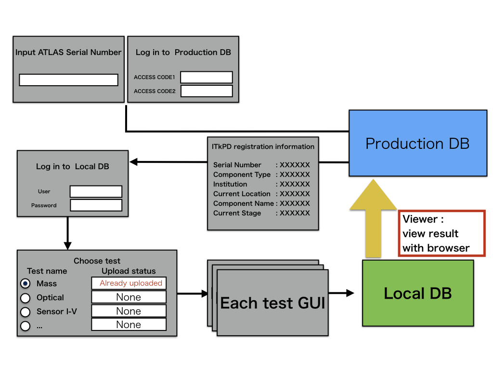
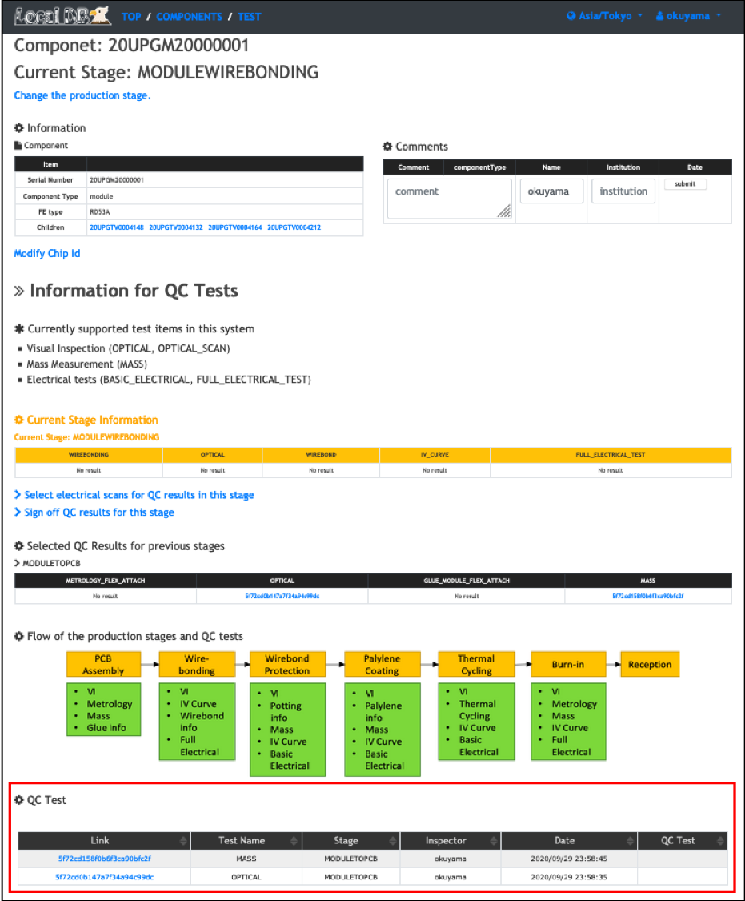

# Non-electrical Tests

## QC-helper
QCHelper is GUI tool to upload QC results to localDB.



### 1. Start GUI

```
cd Workdir/qc-helper
python3 main.py
```
<br>

### 2. Operating procedure

Please follow "instruction.pdf" in the latest version of the [QCHelper](https://gitlab.cern.ch/atlas-itk/sw/db/pixels/qc-viz-tools-dev/qc-helper/-/tree/master/doc/Instruction)

<br>

### 3. Check the uploaded results in LocalDB viewer

Open your browser and access the LocalDB viewer.
The url is [http://127.0.0.1:5000/localdb](http://127.0.0.1:5000/localdb) or https://IPADRESS:5000/localdb.

#### Go to the module's toppage following the instruction below.


You can see the uploaded results in the table of "QC Test" in the page as below.
You can go to the result page for each test by clicking the ids in the table.




<br>
Go to next step.<br>
[Sign-off each stage](signoff.md)<br>
