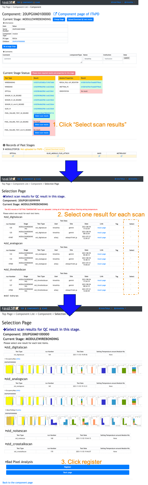
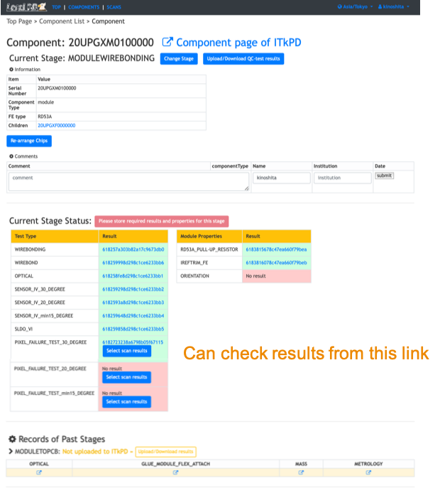

[Tutorial's Top page](flow.md) 
[Previous step](scanconsole.md) 

#  Select Scan Results and register as a QC result
We need to select scans and register those as QC results for an electrical test of this stage.
We are currently supporting the follwing test types and need to select the scans for each item:
### PIXEL_FAILURE_TEST
- std_digitalscan
- std_analogscan
- std_thresholdscan
- std_totscan
- std_noisescan
- std_crosstalk_scan

### 1. Select and Register scans for QC results of electrical tests for this stage

Please follow the instruction below after sign-in on your viewer to click "Sign-in" at the top left conner.

!!! Warning
    We can not take all required data for Pixel Failure Test when we use the YARR emulator scanConsole(we can not see the results for `NoiseOccupany` for `std_noisescan`). LocalDB can not show the bad pixel summary, but we can sign-off and upload this result to ITkPD. For the real scans, we can see the summary. I would like you to try after this tutorial! 

### 2. View the selected results in LocalDB viewer
You can check the selected scans as QC results on the top page of the module in LocalDB viewer.

Go to next step. 
[Sign-off Wirebonding](signoffwire.md) 
