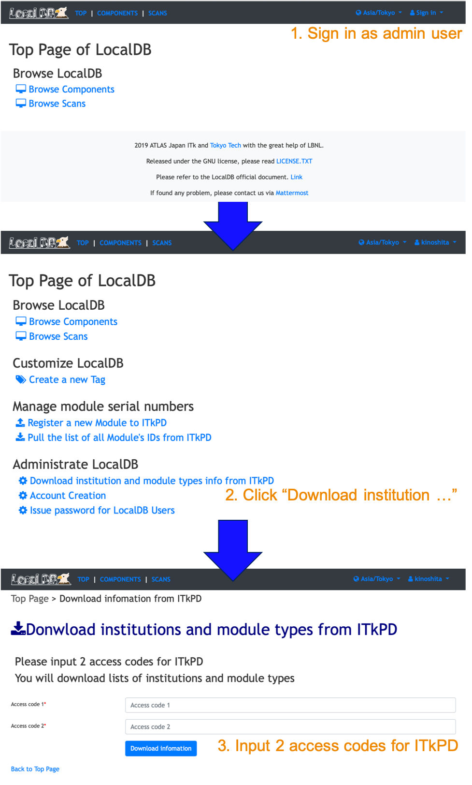

[Tutorial's Top page](flow.md)<br>
[Previous step](mongodb.md)<br>
<hr>

# Viewer Application

### 1. Setup the Viewer Application by the script 'setup_viewer.sh'
Create config file to setup viewer.<br>
Input localdb admin's username and password in the middle of the command.<br>
(e.g.: USERNAME=hokuyama, PASSWORD=itkweek)

!!! Warning
    If you did not install submodules (pltting tools, analysis tools and itkpd-interface), you can not collectry setup LocalDB. Please confirm they are downloaded.

```bash
$ cd ~/work/localdb-tools/viewer
$ ./setup_viewer.sh
Local DB Server IP address: 127.0.0.1
Local DB Server port: 27017

[LDB] Are you sure thats correct? [y/n]
> y

[LDB] Welcome to Local Database Tools!
...
[LDB] Do you use admin functions for LocalDB viewer? [y/n]
> y

Input localDB admins username: USERNAME
Input localDB admins password:

[LDB] Authentication succeeded![LDB] Check plotting tool...
Cloning into '/root/work/localdb-tools/viewer/plotting-tool'...
...
[LDB] More information: https://localdb-docs.readthedocs.io/en/master/
```

### 2. Start LocalDB viewer with the command 'app.py'
Start LocalDB viewer using the following command.<br>
<span style="color: red; ">**Don't kill this process when you see web page. Use another shell from the next step.**</span><br>
We recomend to run this function on background process.

```bash
$ ./app.py --config admin_conf.yml
Need user authentication.
Authentication succeeded.
2020-01-31 23:25:23 localdbserver.cern.ch matplotlib.font_manager[18847] INFO generated new fontManager
2020-01-31 23:25:23 localdbserver.cern.ch root[18847] INFO [LDB] Viewer Application URL: http://127.0.0.1:5000/localdb/
 * Serving Flask app "app" (lazy loading)
 * Environment: production
   WARNING: This is a development server. Do not use it in a production deployment.
   Use a production WSGI server instead.
 * Debug mode: off
2020-01-31 23:25:24 localdbserver.cern.ch werkzeug[18847] INFO  * Running on http://127.0.0.1:5000/ (Press CTRL+C to quit)
```

You can open browser and access the LocalDB viewer.
The url is [http://127.0.0.1:5000/localdb](http://127.0.0.1:5000/localdb) or https://IPADRESS:5000/localdb.


### 3. Download institutions and module types from ITkPD

We need to download institution list and module types list from ITkPD. We will download these infomaiton using LocalDB viewer:



<br>
After setup LocalDB, we will register components to ITkPD.

Go to next step.<br>
[Register Children(PCB, chip, sensor, carrier) to ITkPD](register_children.md)<br>
