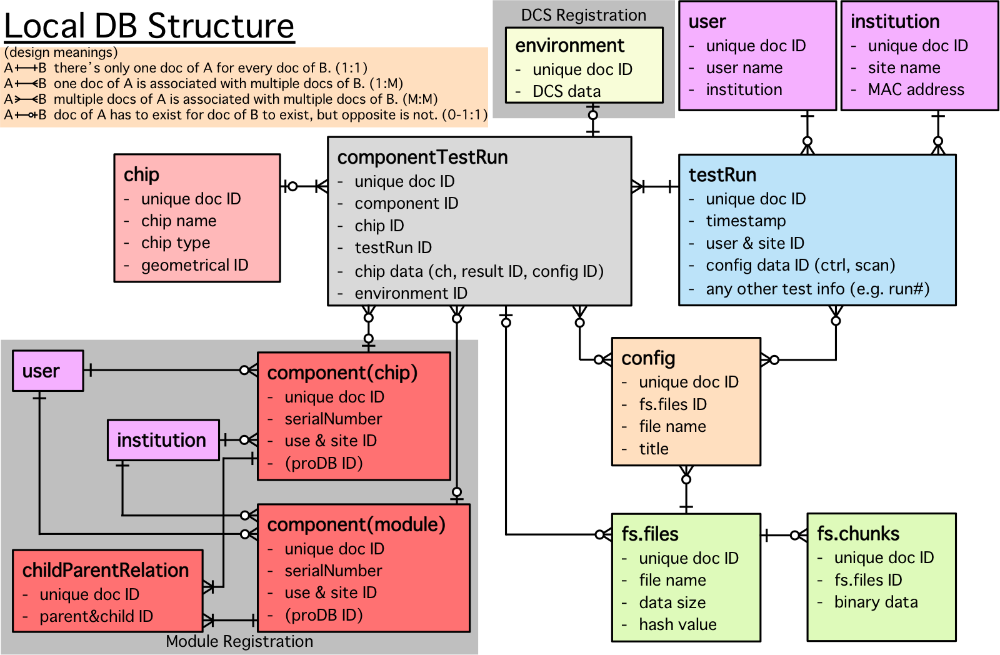

## Database name list
* **localdb**  
Main database for YARR DB

* **localdbtools**  
Database for using in localDB tools e.g.) _synchronization DB_ function

## Data Structure

## Collections (= tables in SQL) name list

### **localdb**

* [**chip**](structure/chip.md)  
Tested chip information

* [**component**](structure/component.md)  
Registered component (chips/modules) information

* [**childParentRelation**](structure/childParentRelation.md)  
Relationship between chips and modules

* [**testRun**](structure/testRun.md)  
Test information

* [**componentTestRun**](structure/componentTestRun.md)  
Relationship between chip/component and testRun

* [**config**](structure/config.md)  
Config information

* [**user**](structure/user.md)  
User information

* [**institution**](structure/institution.md)  
Site information

* [**environment**](structure/environment.md)  
DCS information

* [**fs.files**](structure/GridFS.md) (GridFS)  
Binary (text) File information

* [**fs.chunks**](structure/GridFS.md) (GridFS)  
Binary (text) File chunks
