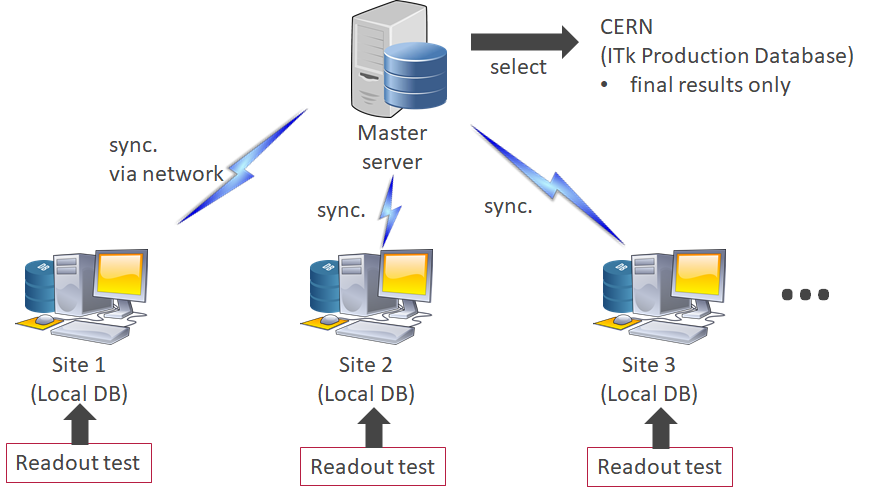
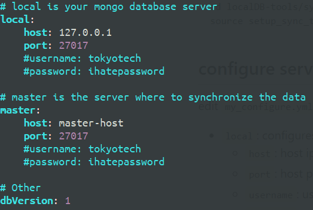
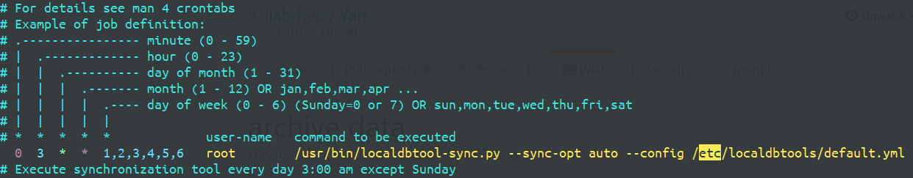

# 1. Introduce
The _sync-tool_ is to synchronize multiple localDB servers for ITk. Before using sync-tool, we need a stable, network-accessible _master server_ which handle whole ITK data.




# 2. Getting start
## a) download
```
git clone https://github.com/jlab-hep/localDB-tools.git
cd localDB-tools/sync-tool
export EDITOR=emacs
# Set editor you usually use, e.g.) emacs, vim, vi
source setup_sync_tool.sh
```

## b) configure servers
edit `my_configure.yml` to config your local mongoDB server and master mongoDB server.



* `local`: configures for local mongoDB server.
  * `host`: host ip of mongoDB. Default value is `localhost` or `127.0.0.1`.
  * `port`: host port of mongoDB. Default value is `27017`.
  * `username`: user name of mongoDB. No username is required by default.
  * `password`: password of mongoDB. No password is required by default.
* `master`: configures for master mongoDB server.
  * please ask to database manager for `host`, `port`, `username` and `password` of master mongoDB server. 

## c) (ADVANCE) install to run sync-tool automatically
`make install` with root privileges. Then edit the configure file `/etc/localdbtools/default.yml`. The sync-tool `usr/bin/localdbtool-sync.py` will be run automatically as schedule task by `cron`. The `cron` configure is `/etc/cron.d/localdbtool-sync`. By default, the task will be Execute every day 3:00 am except Sunday.




# 3. Usage
```
./bin/localdbtool-sync.py  --sync-opt commit --config my_configure.yml
```

## a) options
* `--sync-opt`: options for sync-tool
  * `commit`: commit all new/modified data which taken on the local.
  * `push`: upload committed data to the master server.
  * `fetch`: get commits from the master server.
  * `pull`: get committed data from the master server.
  * `auto`: will do `commit`, `fetch`, `pull` and `push` in order.
* `-f|--config`: path to configure file.
