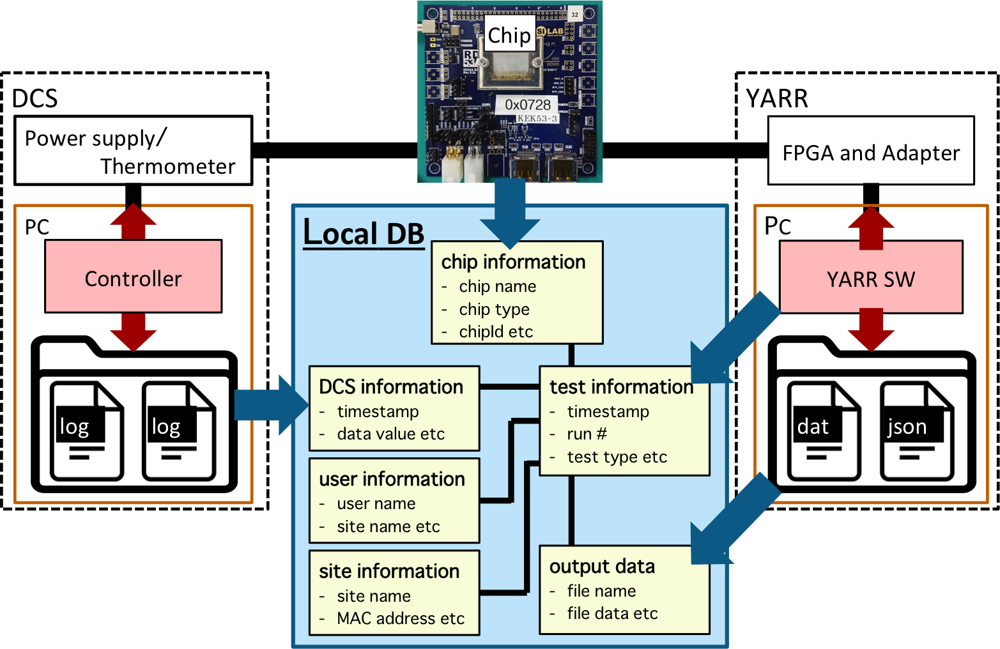

# Upload Tool

The **Upload Tool** is to upload data into Local DB.



### Table of Contents

1. [Command](#1-command)
2. [Getting Start](#2-getting-start)
3. [Usage](#3-usage)
4. [FAQ](#4-faq)

## 1. Command

- Location: **YARR/localdb/bin/localdb-upload**
- Syntax:

```bash
$ ./localdb/bin/localdbtool-upload <option>
                                   [--config <CONFIG>]
                                   [--username <USERNAME>]
                                   [--password <PASSWORD>]
                                   [--database <DATABASE>]
                                   [--user <USER>]
                                   [--site <SITE>]
                                   [--conn <CONN>]
                                   [--log]
                                   [--interactive]
                                   [--QC]

#positional arguments:
#  command               option*		funtion
#                        init		Initialize upload function and check connection to Local DB
#                        comp	<file>	Register component data from specified connectivity file
#                        scan	<dir>	Upload scan data from specified directory
#                        dcs	<dir>	Upload DCS data from specified directory
#                        cache		Upload cache data
#                        check	comp	Check registered component data
#                             	chip	Check registered chip data
#
#optional arguments:
#  -h, --help            show this help message and exit
#  --config CONFIG       Set User Config Path of Local DB Server.
#  --username USERNAME   Set the User Name of Local DB Server.
#  --password PASSWORD   Set the Password of Local DB Server.
#  --database DATABASE, -d DATABASE
#                        Set Database Config Path
#  --user USER, -u USER  Set User Config Path
#  --site SITE, -i SITE  Set Site Config Path
#  --conn CONN           Set Connectivity Config Path
#  --log                 Set Log Mode
#  --interactive         Set Interactive Mode
#  --QC                  Set QC Mode
```

## 2. Getting start

#### 0. Install & Setup

The DB Accessor is included as part of [YARR SW](https://gitlab.cern.ch/YARR/YARR).<br>
Follow the [installation tutorial](../installation.md) to install required packages and make sure to setup Local DB configuration files using [YARR/localdb/setup_db.sh](../script/setup-db.md) shell:

```bash
$ cd YARR
$ ./localdb/setup_db.sh
```

#### 1. Confirmation

Run the command with the option 'init' to check if the command is working and the connection to Local DB is good.

```bash
$ ./localdb/bin/localdbtool-upload init
[  info  ]: Checking connection to DB Server: mongodb://127.0.0.1:27017/localdb ...
[  info  ]: ---> Good connection!
[  info  ]: ------------------------------
```

## 3. Usage

* [Upload the test data after scanConsole or from the specific result directory](#upload-test-data)
* [Register the chip/module data](#register-chipmodule-data)
* [Register the DCS data associated with the test data](#register-dcs-data)
* [Upload the data from cache in the stable connection](#upload-cache-data)

### Upload test data

You can upload the test data associated with the relational data.<br>
There are two ways to upload test data into Local DB:

* `scanConsole -W` to upload test data after scanConsole immediately
* `localdbtool-upload scan` to upload test data from the specific result directory

#### i) scanConsole -W

You can upload test data after scanConsole immediately by `scanConsole -W`.<br>
See [scanConsole -W](scanconsole.md) to get the detail.

#### ii) localdbtool-upload scan

You can upload test data from the specific result directory by `localdbtool-upload scan`.

###### Syntax

```bash
$ ./localdb/bin/localdbtool-upload \
scan <path/to/result/dir> \
--database <path/to/database.json>
```

###### Example

```bash
$ ./localdb/bin/localdbtool-upload \
scan ./data/last_scan \
--database HOME/.yarr/localdb/HOSTNAME_database.json
```

###### Command Line Arguments

- **``--database <database cfg>``**<br> : Set [database config file](../config/database.md) (default: `HOME/.yarr/localdb/HOSTNAME_database.json`)
- **``--user <user cfg>``**<br> : Set [user config file](../config/user.md)
- **``--site <site cfg>``**<br> : Set [site config file](../config/site.md)

### Register Chip/Module Data

You can upload test data associated with the registered chip/module after the registration.<br>
You can register component data by `dbAccessor -C`. <br>
See [DB Accessor](accessor.md) to get the detail.

### Register DCS Data

You can register DCS data associated with the test data for each chip data by `dbAccessor -E`. <br>
See [DB Accessor](accessor.md) to get the detail.

### Upload Cache Data

When you could not upload Scan/DCS data by `scanConsole -W`/`dbAccessor -E` because of the bad connection to Local DB Server,
the cache data and log file ('scanLog.json'/'dbDcsLog.json') would be stored in the result directory,
and that record is written to the file: `HOME/.yarr/localdb/run.dat`/`HOME/.yarr/localdb/dcs.dat`.

In the good connection to Local DB Server, you can upload all cache data by `dbAccessor -R`<br>
See [DB Accessor](accessor.md) to get the detail.

## 4. FAQ

in edit.
