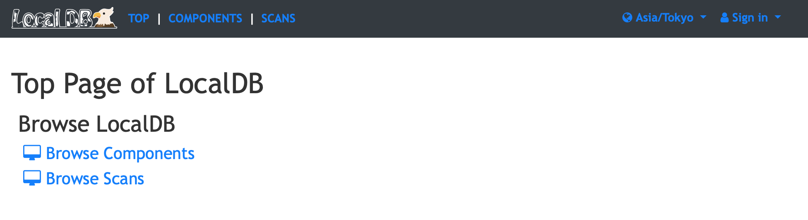

# Viewer Application

The **Viewer Application** displays the contents in Local DB on web browser. <br>
You can check data in Local DB, and upload/download data to/from [ITk Production Database](https://itkpd-test.unicorncollege.cz/).<br>
You can access the web page in the local machine, or from the other machine if you use opneing port or apache service.

### Table of Contents

1. [Command](#1-command)
2. [Getting Start](#2-getting-start)
3. [Usage](#3-usage)
4. [Web Page](#4-web-page)

---

## 1. Command

- Location: **localdb-tools/viewer/app.py**
- Usage:

```bash
$ cd localdb-tools/viewer
$ ./app.py --config <path/to/config>
```

## 2. Getting start

#### 0. Install

The viewer application is included as part of [Local DB Tools](https://gitlab.cern.ch/YARR/localdb-tools).<br>
Follow the [installtaion tutorial](../installation.md) to install required packages.<br>

#### 1. Setup

Setup the configuration files of the viewer application using [localdb-tools/viewer/setup_viewer.sh](../script/setup-viewer.md) shell:

```bash
$ cd localdb-tools/viewer
$ ./setup_viewer.sh
```

#### 2. Confirmation

Once you setup, you can find the configuration file in [localdb-tools/viewer/user_conf.yml](../config/viewer.md#basic-file-formad) or [localdb-tools/viewer/admin_conf.yml](../config/viewer.md#admin-file-format).

## 3. Usage

Viewer Application can be started by:

```bash
$ cd localdb-tools/viewer
$ ./app.py --config conf.yml

Applying ATLAS style settings...

 * Serving Flask app "app" (lazy loading)
 * Environment: production
   WARNING: Do not use the development server in a production environment.
   Use a production WSGI server instead.
 * Debug mode: off
2019-10-09 12:37:46 lazulite werkzeug[1991] INFO  * Running on http://127.0.0.1:5000/ (Press CTRL+C to quit)
```

If you launch the browser on the host machine where the viewer application is running, you can check the viewer page on: [http://127.0.0.1:5000/localdb/](http://127.0.0.1:5000/localdb)<br>
If you want to access the viewer from other machine, see [FAQ for viewer](../faq/viewer.md) to get more detail.

###### Command Line Arguments

- **``--config <path>``**<br>
Specifies the path to [viewer config file](../config/viewer.md).<br>

## 4. [Web Page](viewer/page.md)

The viewer application displays the following page on the browser:

||
|:-:|


###### Page List

- [Component List Page](viewer/top.md#component-list-page)<br>
You can switch to the component list page by clicking **Components Page** in the page list or **COMPONENTS** in the navigation bar.
- [Scan List Page](viewer/top.md#scan-list-page)<br>
You can switch to the scan list page by clicking **Scan Page** in the page list or **TEST** in the navigation bar.
- [Component Page](viewer/component.md)<br>
You can switch to the test result page by clicking **result page** in the component/scan list table.
- [User Page](viewer/user.md)<br>
You can **sign-in** and use vaious functions (create tag, edit comment, download ITk PD module) if you have your account in the Local DB.
- [Admin Page](viewer/admin.md)<br>
You can use vaious functions (create user account, issue password for user account, change component stage) if you have an account with administrator privilege.
