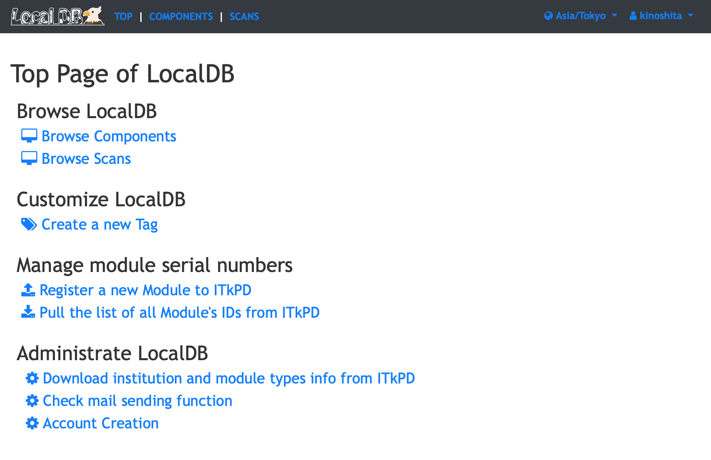
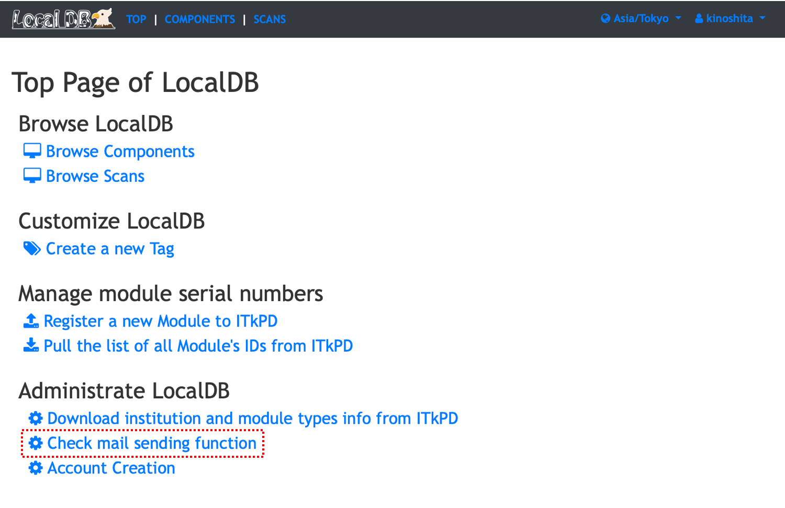

# Admin Page

You can use administrator functions in the admin page if you have an account with administrator privilege.

!!! Note
    The account with administrator privilege here is an administrator account registered in Local DB
    and can be created by [create_admin.sh](../../script/create_admin.md) shell. 

!!! Warning
    In order to use the administrator function, it is required to enable the administrator function in the [viewer setup script](../../script/setup-viewer.md).

### Functions

- [Authentication](#authentication)
- [Confirmation of mail function](#confirmation-of-mail-function)
- [User creation](#user-creation)

---

## Authentication

##### 1. Click **Sign in** on the top right:

||
|:-:|

 

##### 2. Sign in as an **admin user**:

||
|:-:|

 

##### 3. You can get the links to administrate LocalDB:

||
|:-:|

 

## Confirmation of mail function

##### 1. First the administrator must confirm if the mail function is available on **Check mail sending function**:

||
|:-:|

 

##### 2. Enter your e-mail address and click **sending a test mail** to send test-mail to your e-mail address:

||
|:-:|

 

##### 3. Confirm that the following page is displayed and an e-mail will be sent to your address:

||
|:-:|

 

!!! Warning
    If you cannot confirm the received mail, it is possible that the mail function is not available due to some network issue. Please edit `viewer/admin_conf.yml` not to use mail function:
    

## Account Creation

Each user needs a user account to use functions to comment, tag, upload QC scans, etc. 

##### 1. The administrator can register user account in **Account Creation** page:

||
|:-:|

 

##### 2. Fill all information correctly:

||
|:-:|

 

##### 3. Click **Proceed** to go to the confirmation step:

||
|:-:|

 

##### 4. Click **Register** if there is no mistake, or **Back page** if you want to correct:

||
|:-:|

 

##### 5. Confirm that the following page is displayed and the user has received the e-mail:

||
|:-:|

 

##### 6-a. For admin not using mail sending function:
###### The user can sign-in the viewer application according to the instruction written in the e-mali. ######
 

##### 6-b For admin not using mail sending function
||
|:-:|

###### Admin need to tell the username and password for the user and ask the user to set the password. ######
