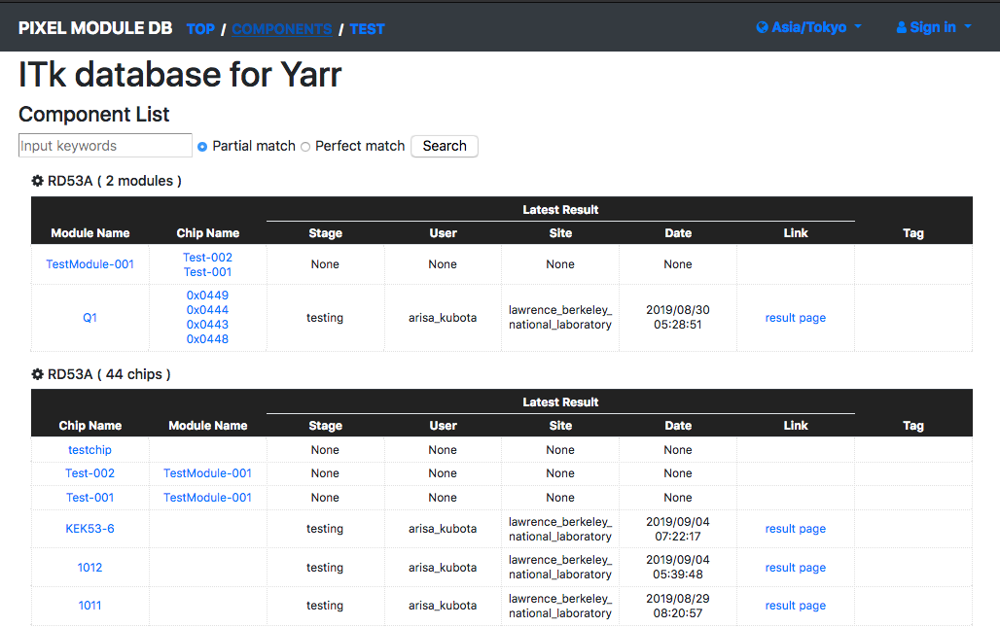
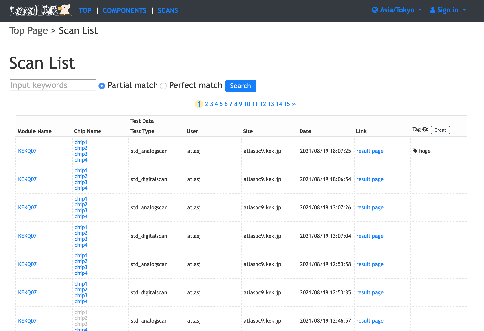

# Viewer Web Page

Please access `http://127.0.0.1:5000/localdb/` on web browser in local machine and it displays the following page:

**Top Page**

||
|:-:|

**Component List Page**

||
|:-:|

**Test List Page**

||
|:-:|

You can access the test result page by clicking 'result page', and it displays the following page:

||
|:-:|

