# User Page

You can sign-in and use vaious functions (create tag, edit comment, pull the list of module SN form ITkPD) if you have your account in the Local DB.

!!! Note
    If you do not have such an account, you need to ask Local DB administrator of your institution to create your account.

### Functions

- [Sign in](#sign-in)
- [Tag Creation](#tag-creation)
- [Register a new Module](#register-a-new-module)
- [Component Download](#component-download)

---

## Sign-in

##### 1. After sign up accroding to the [received mail from the administrator](admin.md#user-creation), click **sign in** on the top right:

|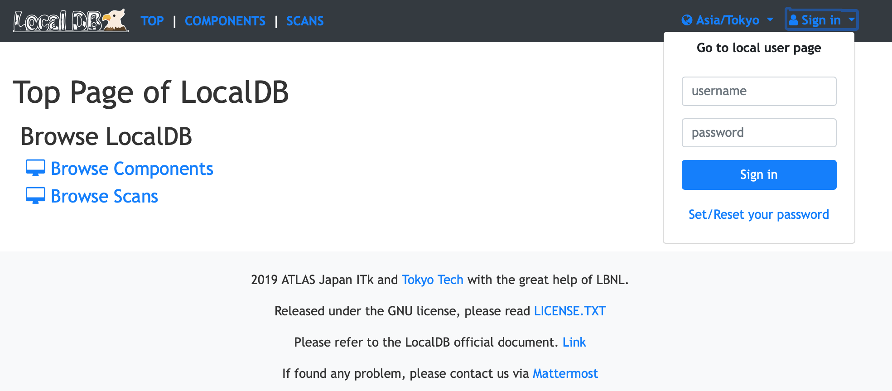|
|:-:|

 

##### 2. Enter username and password of your user account and click **Sign in** to sign in with your account:

|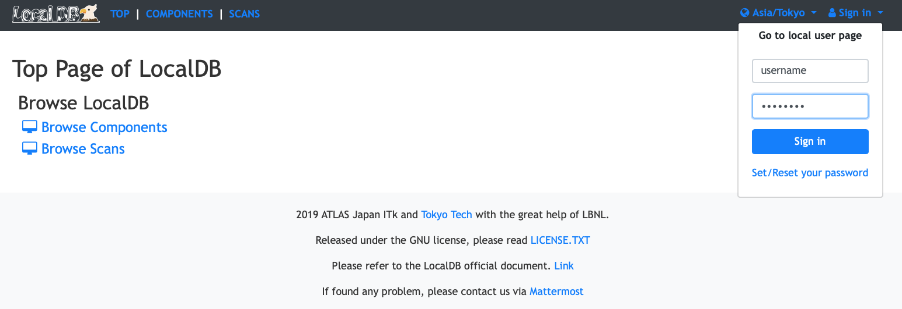|
|:-:|

 

##### 3. You can sign in if authentication successful:

|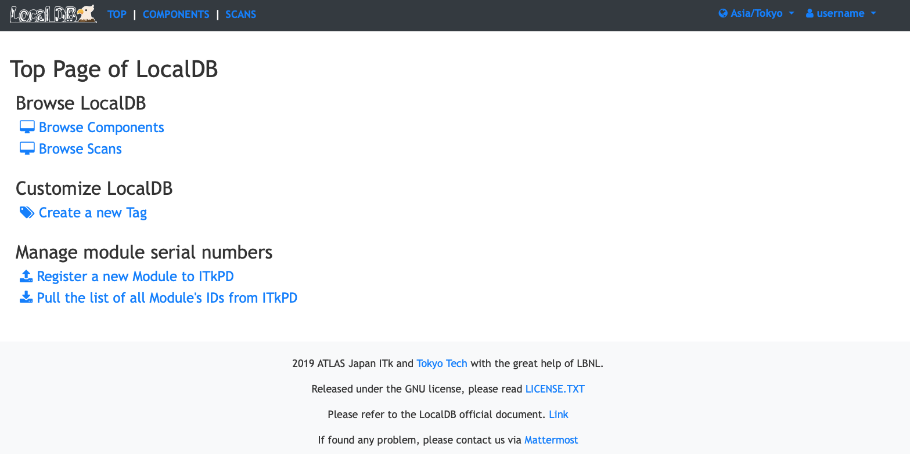|
|:-:|

 

## Tag Creation

##### 1. Click **Create a new Tag**
|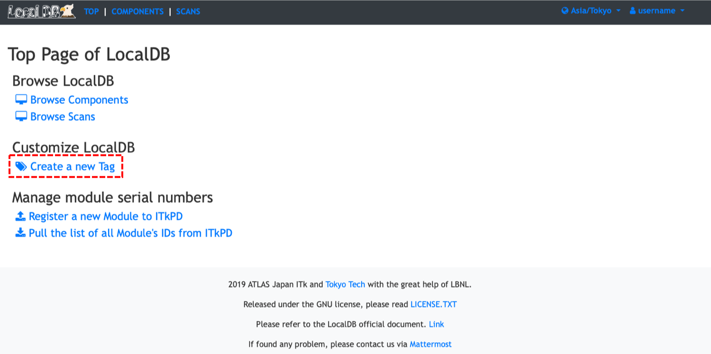|
|:-:|

 

##### 2. Input a **new Tag name**
###### You can use any types of characters except for **'** and **"** .
|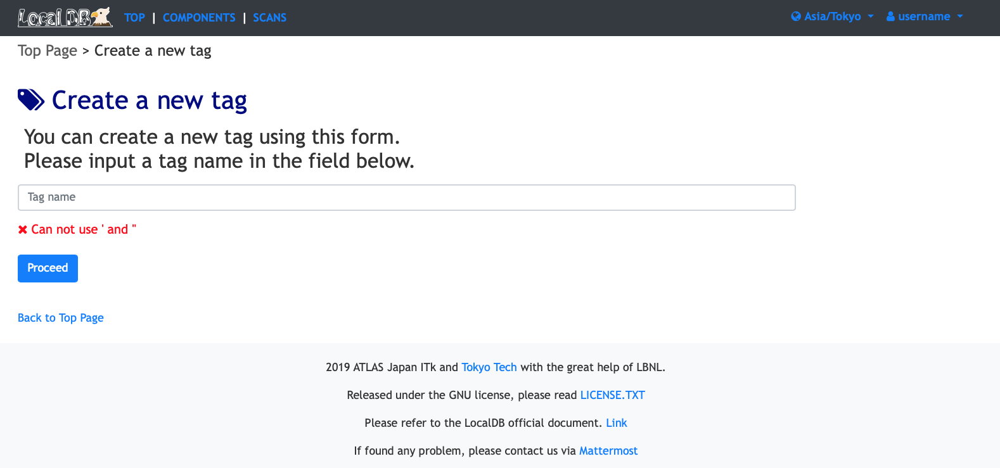|
|:-:|

 

##### 3. Check a tag name and click **create**
|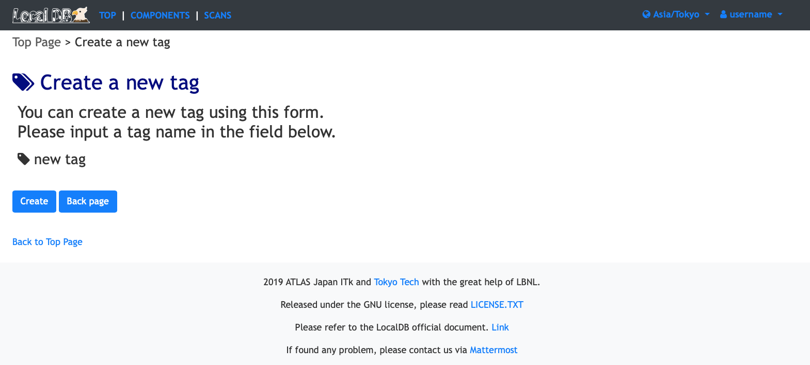|
|:-:|

 

##### 4. Select a tag name with pull down menu:
|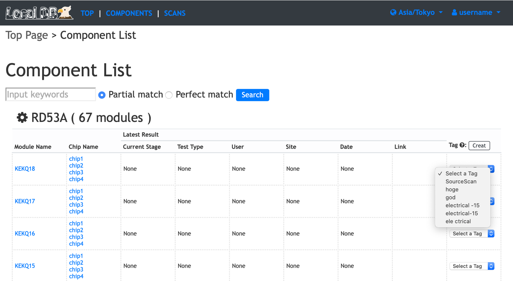|
|:-:|

 

##### 5. Can see attached tag:
###### You can detach a tag by selecting the one twice.
|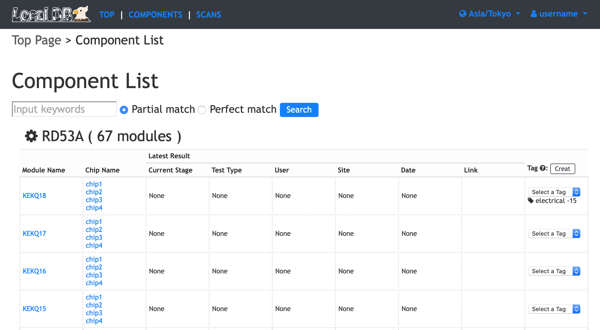|
|:-:|

 

## Register a new Module

##### 1. Click **Register a new Module to ITkPD**
|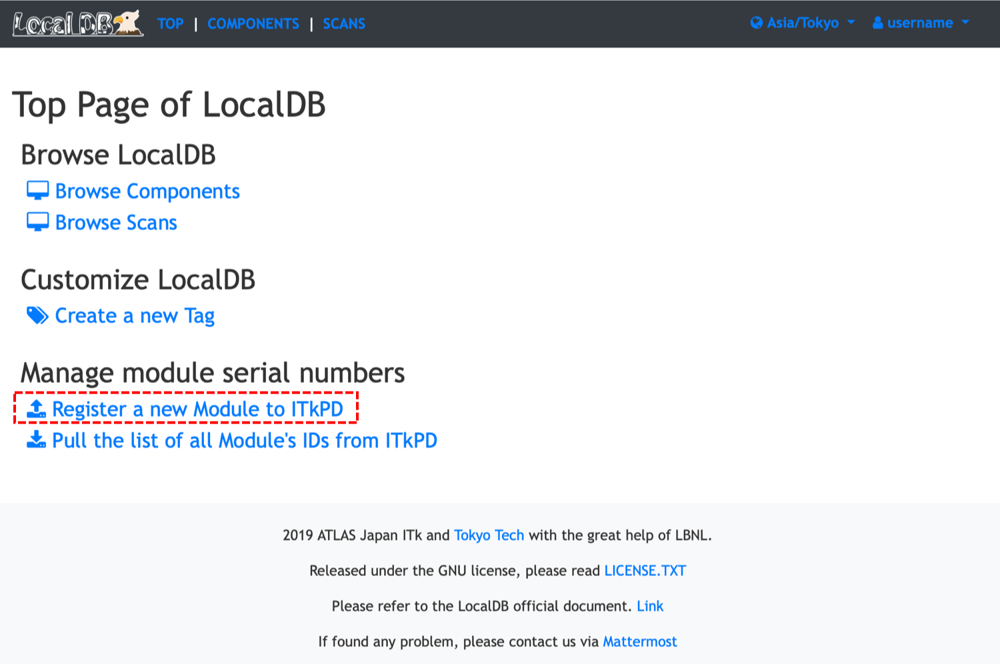|
|:-:|

 

##### 2. Fill out the form
|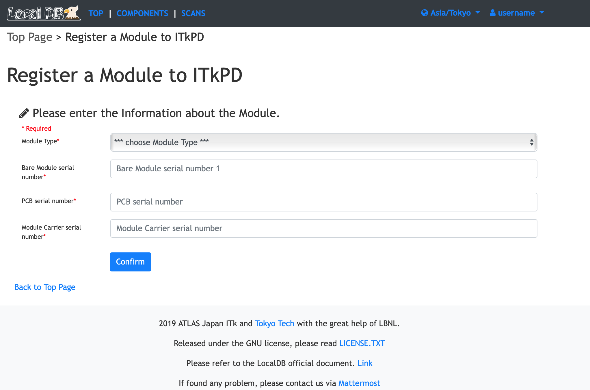|
|:-:|

 

##### 3. Check a new module's serial number and click **Register**
###### Serial number is automatialy asigned: [how to asign serial number](https://cds.cern.ch/record/2728364/files/ATL-COM-ITK-2020-028.pdf?)
|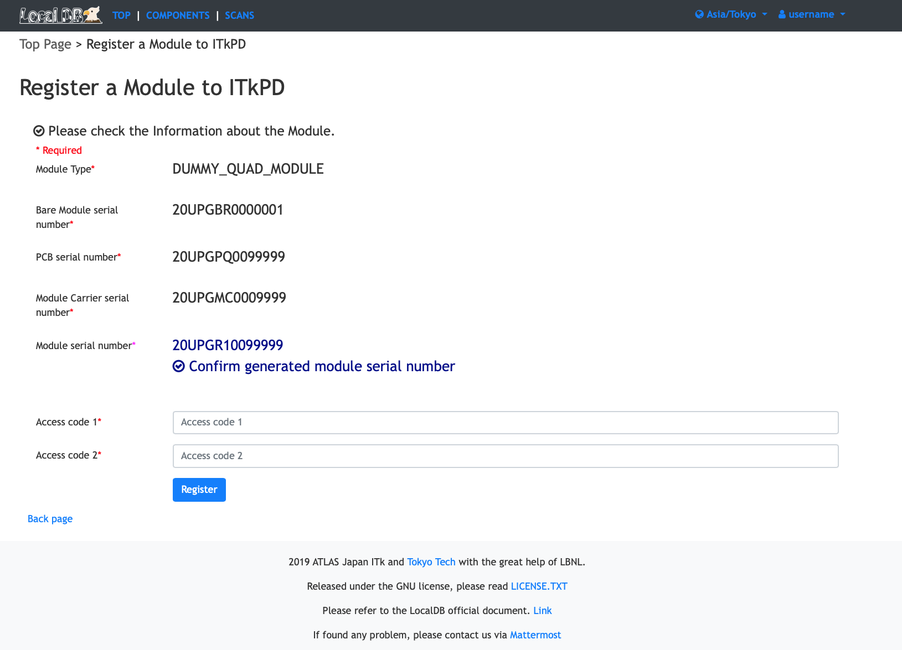|
|:-:|

 

## Component Download

##### 1. Click **Pull the list of all Module's IDs from ITkPD**
|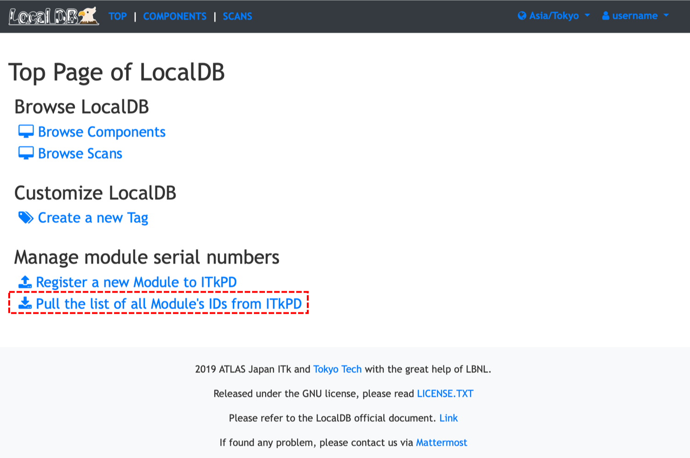|
|:-:|

 

##### 2. Fill **2 access codes for ITkPD**
###### If you push **Download component info**, you can pull the list of all Module's IDs from ITkPD.
###### You can re-name downloaded module's ID to match the one of ITkPD if it is changed.
|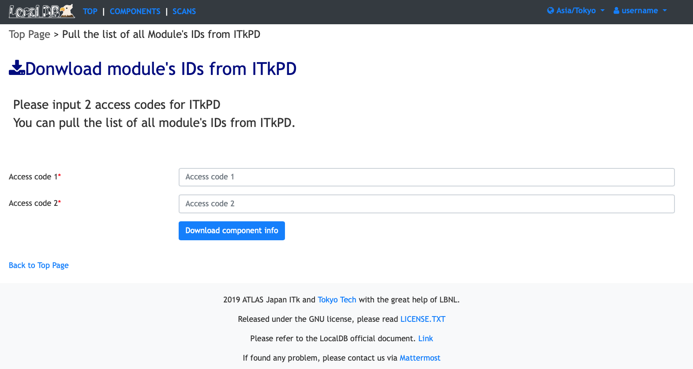|
|:-:|

 
