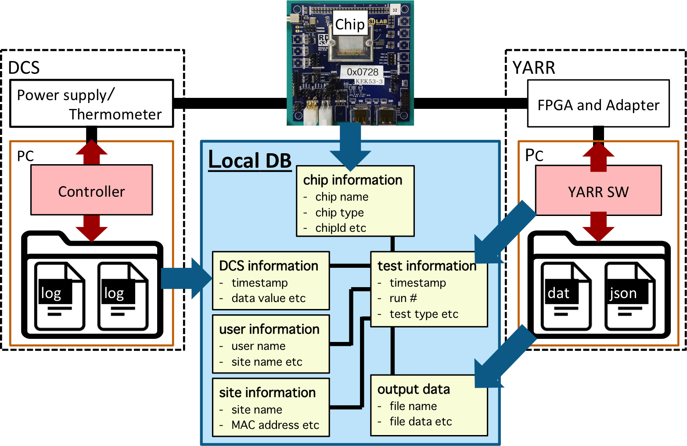

# Upload Tool

The **Upload Tool** is to upload data into Local DB.



Contents:

1. [Command](#1-command)
2. [Getting Start](#2-getting-start)
3. [Usage](#3-usage)
    - upload test data
    - register component data
    - register DCS data
    - upload cache data
4. [FAQ](#4-faq)

## 1. Command

**YARR/localdb/bin/localdb-upload**

```bash
$ ./localdb/bin/localdbtool-upload <option>
                                   [--config <CONFIG>]
                                   [--username <USERNAME>]
                                   [--password <PASSWORD>]
                                   [--database <DATABASE>]
                                   [--user <USER>]
                                   [--site <SITE>]
                                   [--log]
# positional arguments:
#   command              option*	funtion
#                        init	    Function initialization & Connection check
#                        comp	    Component registration
#                        scan	    Scan data upload
#                        dcs	    DCS data upload
#                        cache	  Cache data upload
#                        check	  Registered component check
#                        test	    Testing command
# optional arguments:
#   -h, --help           show this help message and exit
#   --config CONFIG      Set User Config Path of Local DB Server
#   --username USERNAME  Set the User Name of Local DB Server
#   --password PASSWORD  Set the Password of Local DB Server
#   --database DATABASE  Set Database Config Path
#   --user USER          Set User Config Path
#   --site SITE          Set Site Config Path
#   --log                Set Log Mode
```

## 2. Getting start

#### 0. Install & Setup

Please check [Pre Requirements](installation.md) to install required packages.<br>
And please be sure to setup Local DB setting using `YARR/localdb/setup_db.sh`. <br>
This script confirms

- if the python packages is satisfied
- if the default config files are prepared
    - HOME/.yarr/localdb/HOSTNAME_database.json
    - HOME/.yarr/localdb/user.json
    - HOME/.yarr/localdb/HOSTNAME_site.json
- if the command is enabled
- if the DB connection is established

```bash
$ cd YARR
$ ./localdb/setup_db.sh
< Setting up with some texts >
```
> [More detail about setup_db.sh](script/setup-db.md)

#### 1. Confirmation

Please run the command with the option 'init' to check if the command is working and the connection to Local DB is good.

```bash
$ ./localdb/bin/localdbtool-upload init
#DB INFO# -----------------------
#DB INFO# Function: Initialize
#DB INFO# [Connection Test] DB Server: mongodb://127.0.0.1:27017/localdb
#DB INFO# ---> Connection is GOOD.
#DB INFO# -----------------------
```

**Additional options**

- **--database ``<database cfg>``**<br> : Set [database config file](config/database.md) (default: `HOME/.yarr/localdb/HOSTNAME_database.json`)

## 3. Usage

Upload Tool performs following functions:

* a. [Upload the test data after scanConsole or from the specific result directory](#a-upload-test-data)
* b. [Register the chip/module data](#b-register-chipmodule-data)
* c. [Register the DCS data associated with the test data](#c-register-dcs-data)
* d. [Upload the data from cache in the stable connection](#d-upload-cache-data)

### a. Upload test data

You can upload the test data associated with the relational data.<br>
Please look at [Structure](structure.md) to get more detail about the structure of Local DB. <br>
There are two ways to upload test data into Local DB:

* `scanConsole -W` to upload test data after scanConsole immediately
* `localdbtool-upload scan` to upload test data from the specific result directory

#### i) scanConsole -W

You can upload test data after scanConsole immediately by `scanConsole -W`.<br>
Check [scanConsole -W](scanconsole.md) to get the detail.

#### ii) localdbtool-upload scan

You can upload test data from the specific result directory by `localdbtool-upload scan`.

```bash
$ ./localdb/bin/localdbtool-upload scan <path/to/result/dir> --database <path/to/database/config>
e.g.) $ ./localdb/bin/localdbtool-upload scan ./data/last_scan --database HOME/.yarr/localdb/HOSTNAME_database.json
```

**Additional options**

- **--database ``<database cfg>``**<br> : Set [database config file](config/database.md) (default: `HOME/.yarr/localdb/HOSTNAME_database.json`)
- **--user ``<user cfg>``**<br> : Set [user config file](config/user.md)
- **--site ``<site cfg>``**<br> : Set [site config file](config/site.md)
- **--log**<br> : Set logging mode 'True' (default 'False'). The output log is written in `HOME/.yarr/localdb/log/day.log`
- **--username ``<username>``**<br> : Set username of the Local DB Server if the user authentication is required
- **--password ``<password>``**<br> : Set password of the Local DB Server if the user authentication is required
- **--config ``<config file>``**<br> : Set config file which username and password are written in if the user authentication is required

### b. Register Chip/Module Data

You can upload test data associated with the registered chip/module after the registration.<br>
You can register component data by `dbAccessor -C`. <br>
Check [DB Accessor](accessor.md) to get the detail.

### c. Register DCS Data

You can register DCS data associated with the test data for each chip data by `dbAccessor -E`. <br>
Check [DB Accessor](accessor.md) to get the detail.

### d. Upload Cache Data

When you could not upload Scan/DCS data by `scanConsole -W`/`dbAccessor -E` because of the bad connection to Local DB Server, <br>
the cache data and log file ('scanLog.json'/'dbDcsLog.json') would be stored in the result directory,<br>
and that record is written to the file: `HOME/.yarr/run.dat`/`HOME/.yarr/dcs.dat`.

In the good connection to Local DB Server, you can upload all cache data by `localdbtool-upload cache`:

```bash
$ ./localdb/bin/localdbtool-upload cache
```

## 4. FAQ

in edit.
