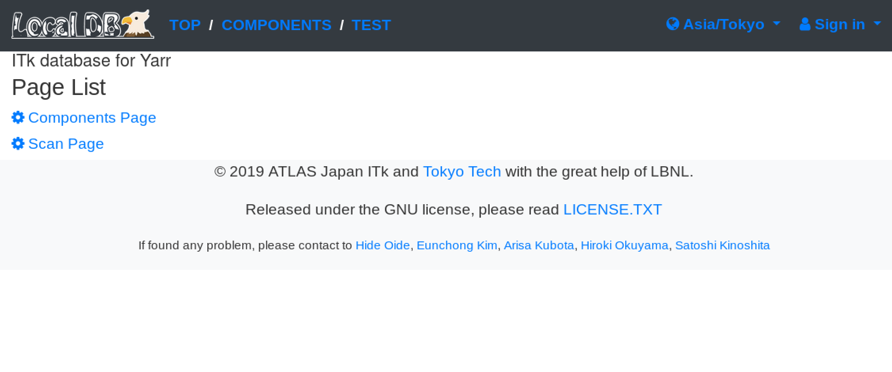

## Admin Page

You can use administrator functions in the admin page if you have an account with administrator privilege.

!!! Note
    The account with administrator privilege here is an administrator account registered in Local DB
    and can be created by [create_admin.sh](create_admin.md) shell. 

#### Authentication

##### 1. Click "sign in" in the navigation bar and click the "Admin Page"

||
|:-:|

##### 2. Fill username and password of the administrator account

||
|:-:|

##### 3. Successful authentication

#### Account Creation

in edit.
