# Viewer Tutorial

This tutorial describes the oprations related to [viewer](viewer.md) setup and some browser functions.

!!! Recommend
    If you have not uploaded any data into Local DB yet, it is recommended to see the [basic tutorial](basic-tutorial.md) and upload scan data before proceeding with this page.

### Table of Contents

1. [How to Setup Viewer Application](#1-how-to-setup-viewer)
2. [How to Check Data in Viewer Application](#2-how-to-check-data-in-viewer)
3. [How to Use Administrator Functions in Viewer Application](#3-how-to-use-administrator-functions)
4. [How to Use User Functions in Viewer Application](#4-how-to-use-user-functions)

---

## 1. How to Setup Viewer

#### Create administrator account

First create an administrator account in Local DB using [localdb-tools/setting/create_admin.sh](create_admin.md) to enable the administrator functions in the [viewer application](viewer.md).<br>
If you have the administrator account already, you can skip this step.

```bash
$ cd localdb-tools/setting
$ ./create_admin.sh -p 27017
Authentication succeeded!
Local DB Server IP address: 127.0.0.1
Local DB Server port: 27017

Are you sure that's correct? [y/n]
> y
```

Answer **y** to proceed if you did not change any settings when you installed MongoDB.<br>

```bash
### script output
Register localDB admin's username: username
Register localDB admin's password: xxxxxxxx
```

Set username and password for the administrator account and the script creates the account in Local DB.

!!! Note
    See the [admin functions in the viewer](viewer.md) to get more about what you can do.

!!! Recommend
    You can improve the security of data access by locking the Local DB.<br>
    If you want to lock Local DB, set `security.authorization: enabled` in `etc/mongod.conf` and restart mongod instance.<br>
    See the [MongoDB documentation](https://docs.mongodb.com/manual/tutorial/enable-authentication/) to get more detail.

#### Setup configuration

Next setup the configuration files of the [viewer application](viewer.md) using [localdb-tools/viewer/setup_viewer.sh](setup_viewer.md) script:

```bash
$ cd localdbtools/viewer
$ ./setup_viewer.sh -p 27017
```

This script checks missing python packages, prepares default config files, install some useful functions using git.

```bash
### script output
Local DB Server IP address: 127.0.0.1
Local DB Server port: 27017

[LDB] Are you sure that's correct? [y/n]
> y
```

Answer **y** to proceed if you did not change any settings when you installed MongoDB.<br>

```bash
### script output
[LDB] Do you use admin functions for LocalDB viewer? [y/n]
> y
```

Answer **n** to proceed if you creates the administrator account in the previous step.

```bash
### script output
Input localDB admin's username: username
Input localDB admin's password: xxxxxxxx

[LDB] Authentication succeeded!
```

Enter username and password of the administrator account, and you will get the output of "Authenticasion suceeded!" if successful.

```bash
### script output
[LDB] Set ROOT installed directroy. (Enter path/to/dir or 'skip')
> /opt/root/6.16.00-build
```

If you do not have added the path to ROOT, the script will prompt you to set the directory where you installed ROOT.<br>
Set the path to directory if you have installed ROOT, or enter **skip** if not.<br>

!!! Warning
    If the ROOT is not available, some features such as plotting will not be available in the viewer application.

```bash
### script output
[LDB] Finished setting up of Viewer Application!!
```

The output of "Finished setting!" means that the script is done.

#### Run application

Run **localdb-tools/viewer/app.py** python script to start the [viewer application](viewer.md) on the local host machine:

```bash
$ python3 app.py --config user_conf.yml
2020-08-27 15:28:09 guest0 root[29905] INFO [LDB] Viewer Application URL: http://127.0.0.1:5000/localdb/
 * Serving Flask app "app" (lazy loading)
 * Environment: production
   WARNING: This is a development server. Do not use it in a production deployment.
   Use a production WSGI server instead.
 * Debug mode: off
2020-08-27 15:28:09 guest0 werkzeug[29905] INFO  * Running on http://0.0.0.0:5000/ (Press CTRL+C to quit)
```

You can access the Local DB viewer on the local browser while this application is running.<br>

## 2. How to Check Data in Viewer

#### Top Page

Access [http://127.0.0.1:5000/localdb/](http://127.0.0.1:5000/localdb/) on the local browser:

||
|:-:|

<br>

#### Scan List Page

Click **Scan Page** to switch to the scan list page:

||
|:-:|

<br>

#### Scan Result Page

Click **result page** to switch the scan result page:

||
|:-:|

<br>

## 3. How to Use Administrator Functions

- [Authentication](#authentication)
- [Confirmation of mail function](#confirmation-of-mail-function)
- [User creation](#user-creation)

#### Authentication

Click **Sign in** on the top right:

|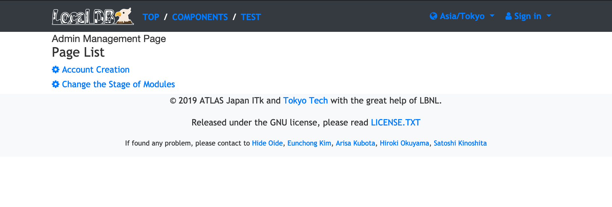|
|:-:|

<br>

Click **Admin Page**:

|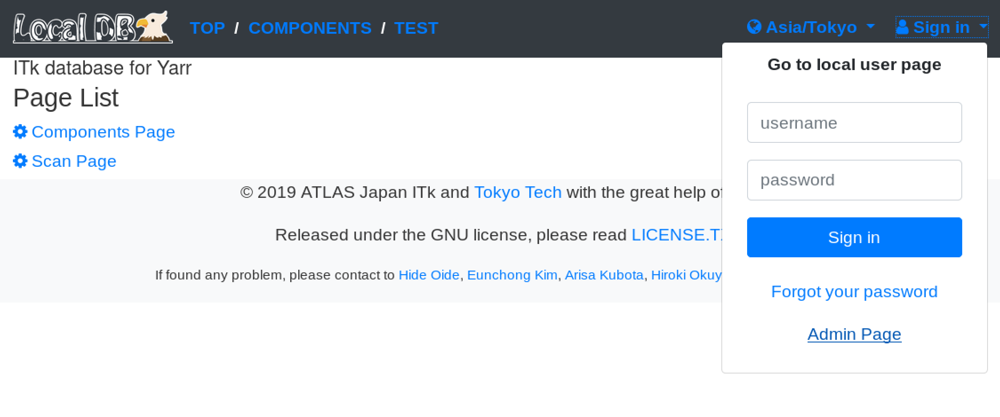|
|:-:|

<br>

Enter username and password of the administrator acciount and click **OK**:

|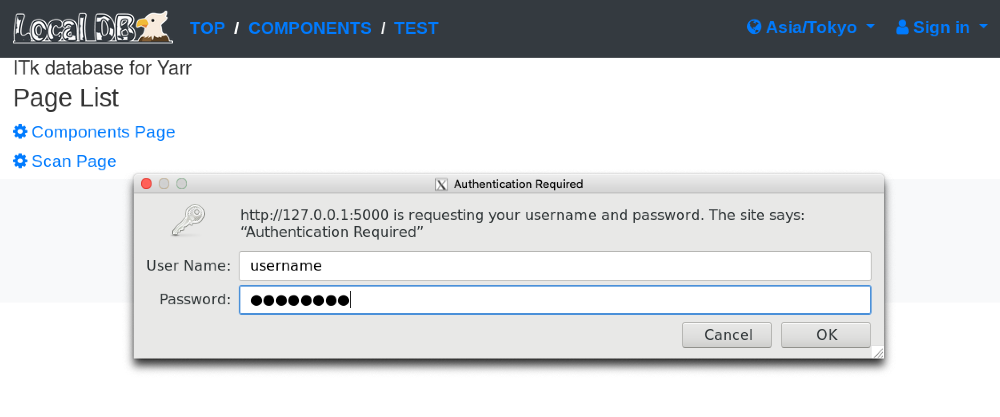|
|:-:|

You can get the admin management page if authentication successful:

|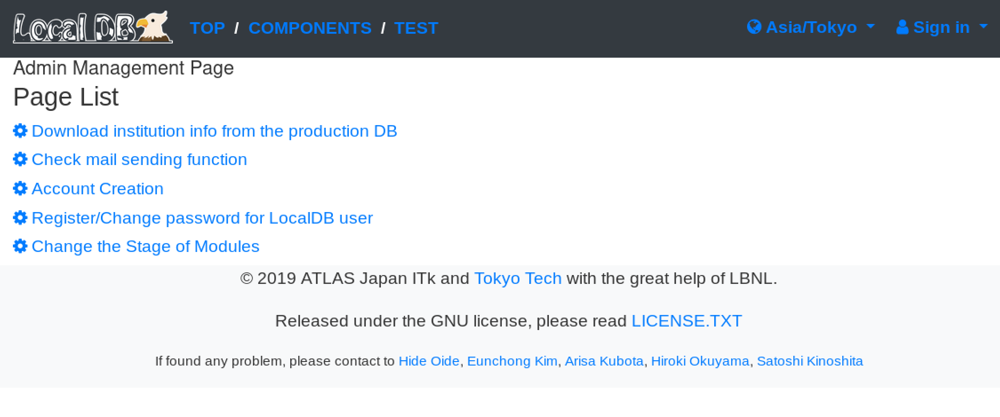|
|:-:|

#### Confirmation of mail function

First the administrator must confirm if the mail function is available on **Check mail sending function**:

|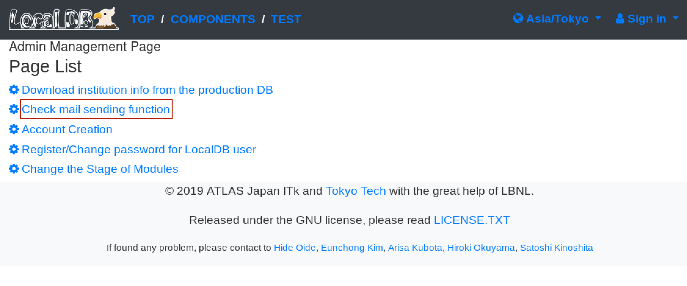|
|:-:|

Enter your e-mail address and click **sending a test mail** to send test-mail to your e-mail address:

|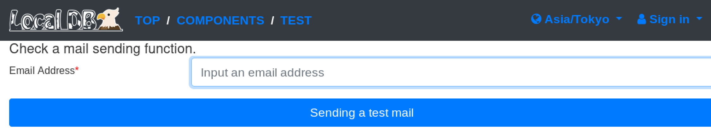|
|:-:|

Confirm that the following page is displayed and an e-mail will be sent to your address:

|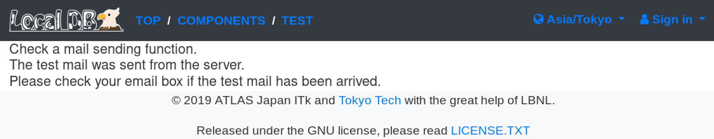|
|:-:|

!!! Warning
    If you cannot confirm the received mail, it is possible that the mail function is not available due to some network issue.

#### User creation

Each user needs a user account to use functions to comment, tag, upload QC scans, etc.<br>
The administrator can register user account in **Account Creation** page:

|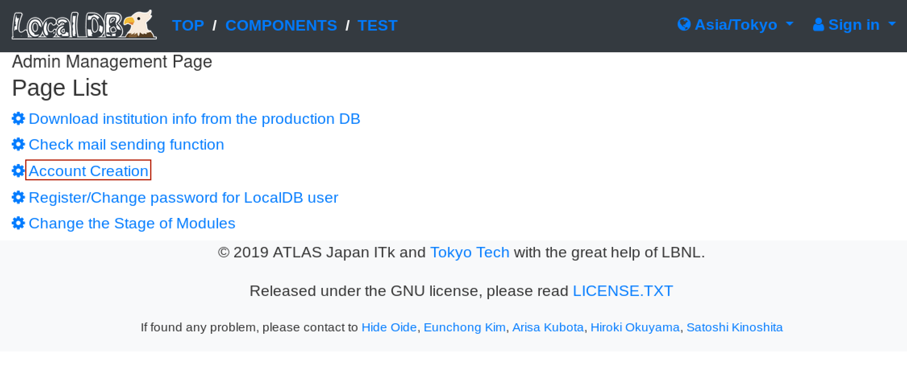|
|:-:|

Fill all information correctly:

|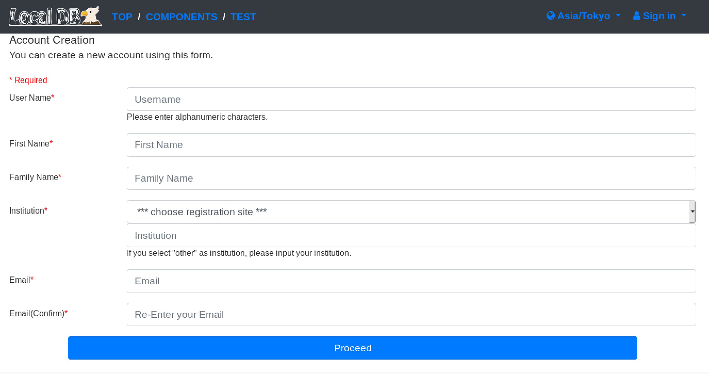|
|:-:|

Click **Proceed** to go to the confirmation step:


|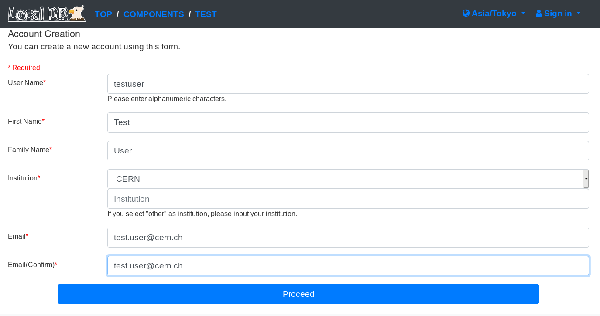|
|:-:|

Click **Register** if there is no mistake, or **Back page** if you want to correct:

|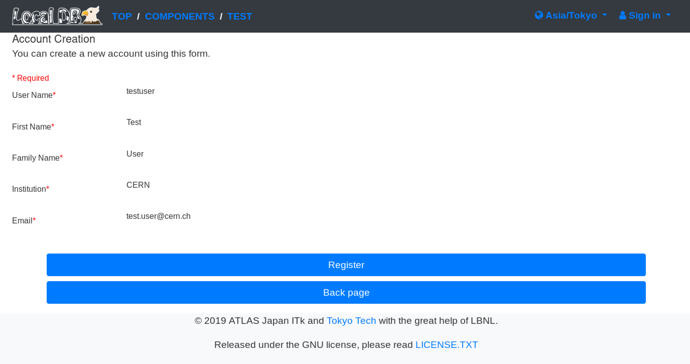|
|:-:|

Confirm that the following page is displayed and the user has received the e-mail:

|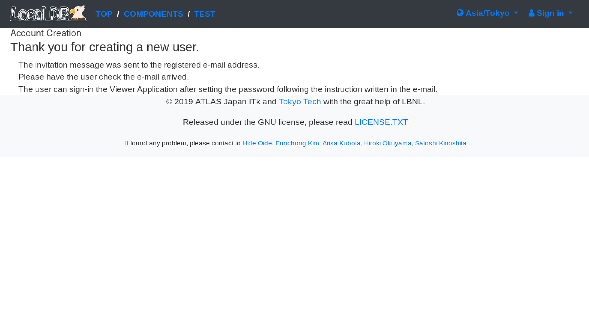|
|:-:|

The user can sign-in the viewer application according to the instruction written in the e-mali.

## 4. How to Use User Functions

- [Sign-in](#sign-in)

#### Sign in

After sign up accroding to the [received mail from the administrator](#user-creation), click **sign in** on the top right:

|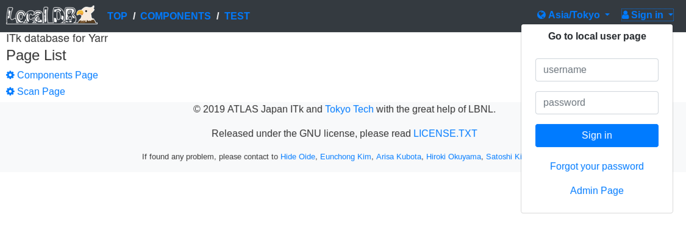|
|:-:|

Enter username and password of your user account and click **Sign in** to sign in with your account:

||
|:-:|

You can sign in if authentication successful:

|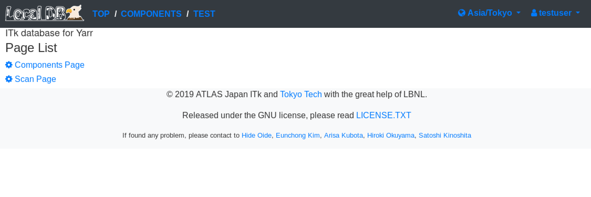|
|:-:|
