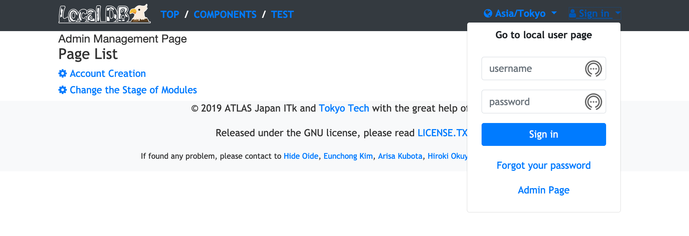
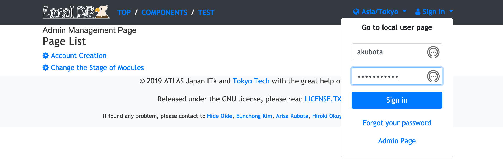
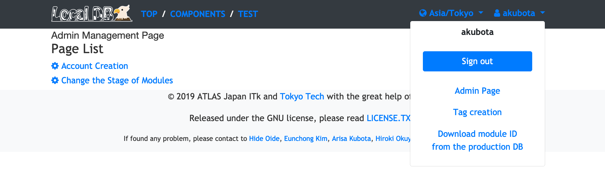

## User Page

You can sign-in and use vaious functions (create tag, edit comment, download ITk PD module) if you have your account in the Local DB.

!!! Note
    If you do not have such an account, you need to ask Local DB administrator of your institution to create your account.

#### Sign-in

##### 1. Click "sign in" in the navigation bar

||
|:-:|

##### 2. Fill your username and password

||
|:-:|

##### 3. Enter the "Sign in" button

||
|:-:|

##### 4. Successful sign-in

#### Tag Creation

in edit.

#### Component Download

in edit.
