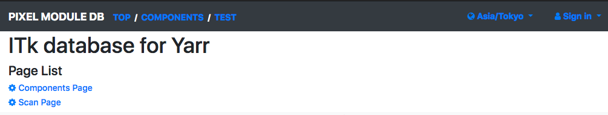
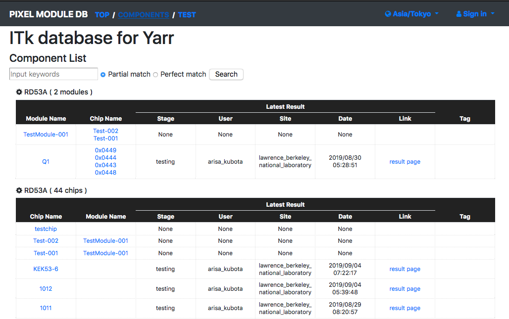
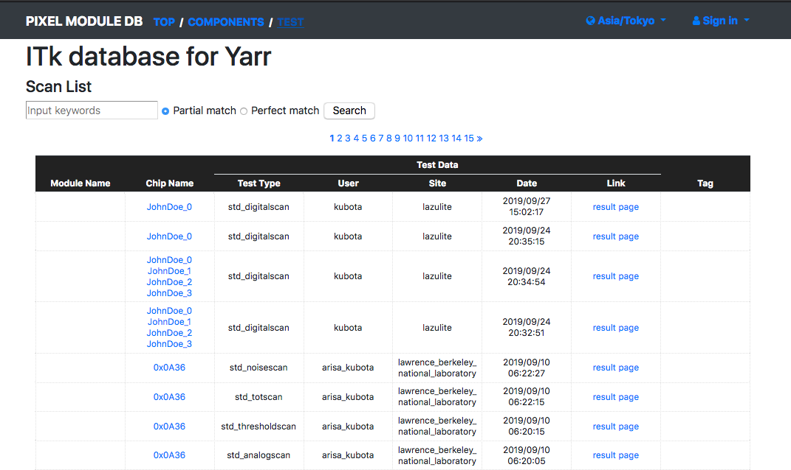

# Viewer Application

The **viewer** is display the contents in Local DB on web browser. <br>
You can access the web page in the local machine, or from the other machine by opneing port or using apache service.

Contents:

0. [Command](#0-command)
1. [Getting Start](#1-getting-start)
2. [Usage](#2-usage)
3. [Web Page](#3-web-page)
4. [FAQ](#4-faq)

## 0. Command

**localdb-tools/viewer/app.py**

```bash
$ ./app.py --config <path/to/config>
```

## 1. Getting start

Please check [Pre Requirements](requirements.md) to install required packages.<br>
And please be sure to setup Viewer Application setting using `localdb-tools/viewer/setup_viewer.sh`. <br>
This script performs

- to check if required python modules are installed
- to confirm the viewer config file ( [localdb-tools/viewer/conf.yml](config.md) )
- to compile the [plotting tool](https://gitlab.cern.ch/YARR/utilities/plotting-tools) for displaying plots on the browser

```bash
$ cd localdb-tools/viewer
$ ./setup_viewer.sh
< Setting up with some texts >
```

**Additional options**

- **-i ``<IP address>``**<br> : Set Local DB server IP address (default: 127.0.0.1)
- **-p ``<port>``**<br> : Set Local DB server port (default: 27017)
- **-c ``<cfg>``**<br> : Set config file Name (default: conf.yml)

## 2. Usage

Viewer Application can be started by `app.py --config conf.yml`

```bash
$ cd localdb-tools/viewer
$ ./app.py --config conf.yml

Applying ATLAS style settings...

 * Serving Flask app "app" (lazy loading)
 * Environment: production
   WARNING: Do not use the development server in a production environment.
   Use a production WSGI server instead.
 * Debug mode: off
2019-10-09 12:37:46 lazulite werkzeug[1991] INFO  * Running on http://127.0.0.1:5000/ (Press CTRL+C to quit)
```

**Command Line Arguments**

- **--config ``<cfg>``**<br> : Set config file path

## 3. Web Page

Please access `http://127.0.0.1:5000/localdb/` on web browser in local machine and it displays the following page:

**Top Page**

||
|:-:|

**Component List Page**

||
|:-:|

**Test List Page**

||
|:-:|

You can access the test result page by clicking 'result page', and it displays the following page:

||
|:-:|

## 4. FAQ

- Remote Access/Apache

In edit.

