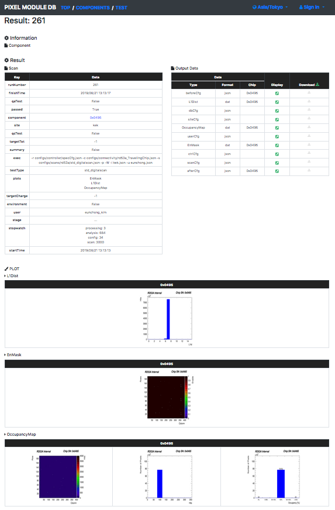

# Viewer Application

The **Viewer Application** displays the contents in Local DB on web browser. <br>
You can check data in Local DB, and upload/download data to/from [ITk Production Database](https://itkpd-test.unicorncollege.cz/).<br>
You can access the web page in the local machine, or from the other machine if you use opneing port or apache service.

Contents:

1. [Command](#1-command)
2. [Getting Start](#2-getting-start)
3. [Usage](#3-usage)
4. [Web Page](#4-web-page)
5. [FAQ](#5-faq)

## 1. Command

- Location: **localdb-tools/viewer/app.py**
- Usage:

```bash
$ cd localdb-tools/viewer
$ ./app.py --config <path/to/config>
```

## 2. Getting start

#### 0. Install

The viewer application is included as part of [Local DB Tools](https://gitlab.cern.ch/YARR/localdb-tools).<br>
Follow the [installtaion tutorial](requirements.md) to install required packages.<br>

#### 1. Setup

Make sure to setup the configuration files of the viewer application using [localdb-tools/viewer/setup_viewer.sh](setup-viewer.md) shell:

```bash
$ cd localdb-tools/viewer
$ ./setup_viewer.sh
```

#### 2. Confirmation

Once you setup, you can find the configuration file in [localdb-tools/viewer/user_conf.yml](viewer-config.md) or [localdb-tools/viewer/admin_conf.yml](viewer-config.md).

## 3. Usage

Viewer Application can be started by `app.py --config conf.yml`

```bash
$ cd localdb-tools/viewer
$ ./app.py --config conf.yml

Applying ATLAS style settings...

 * Serving Flask app "app" (lazy loading)
 * Environment: production
   WARNING: Do not use the development server in a production environment.
   Use a production WSGI server instead.
 * Debug mode: off
2019-10-09 12:37:46 lazulite werkzeug[1991] INFO  * Running on http://127.0.0.1:5000/ (Press CTRL+C to quit)
```

**Command Line Arguments**

- **--config ``<cfg>``**<br> : Set config file path

## 4. Web Page

Please access `http://127.0.0.1:5000/localdb/` on web browser in local machine and it displays the following page:

**Top Page**

||
|:-:|

**Component List Page**

||
|:-:|

**Test List Page**

||
|:-:|

You can access the test result page by clicking 'result page', and it displays the following page:

||
|:-:|

## 5. FAQ

- Remote Access/Apache

In edit.

