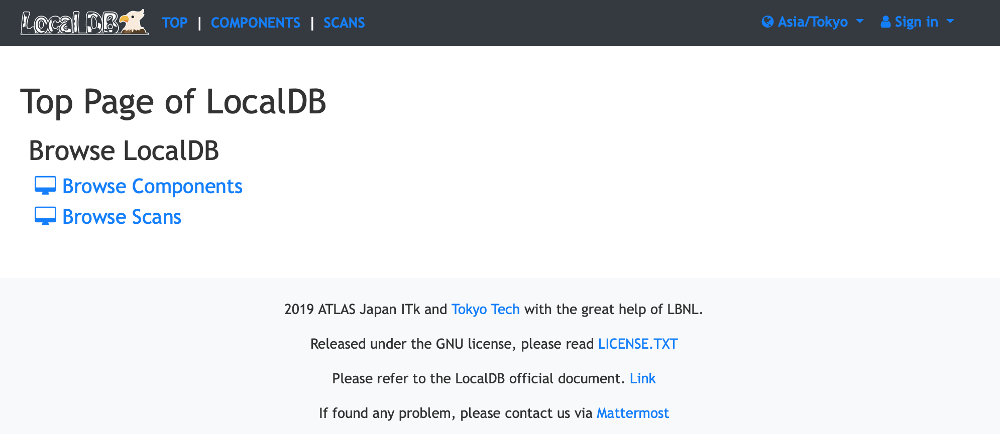
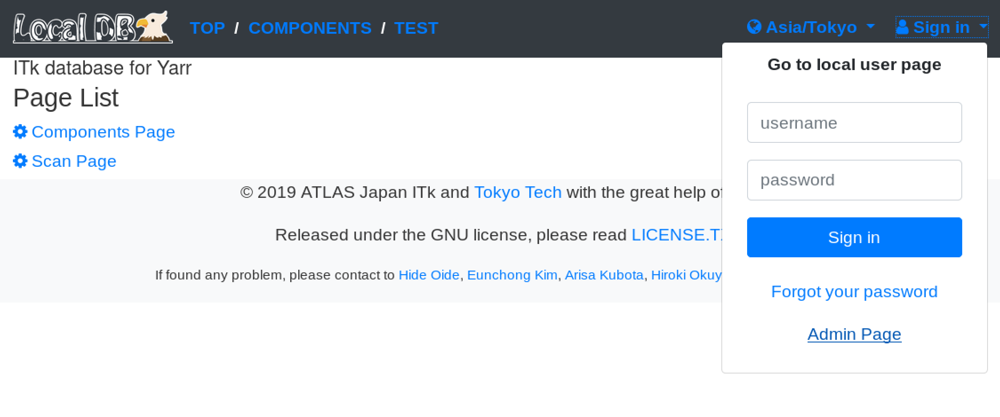
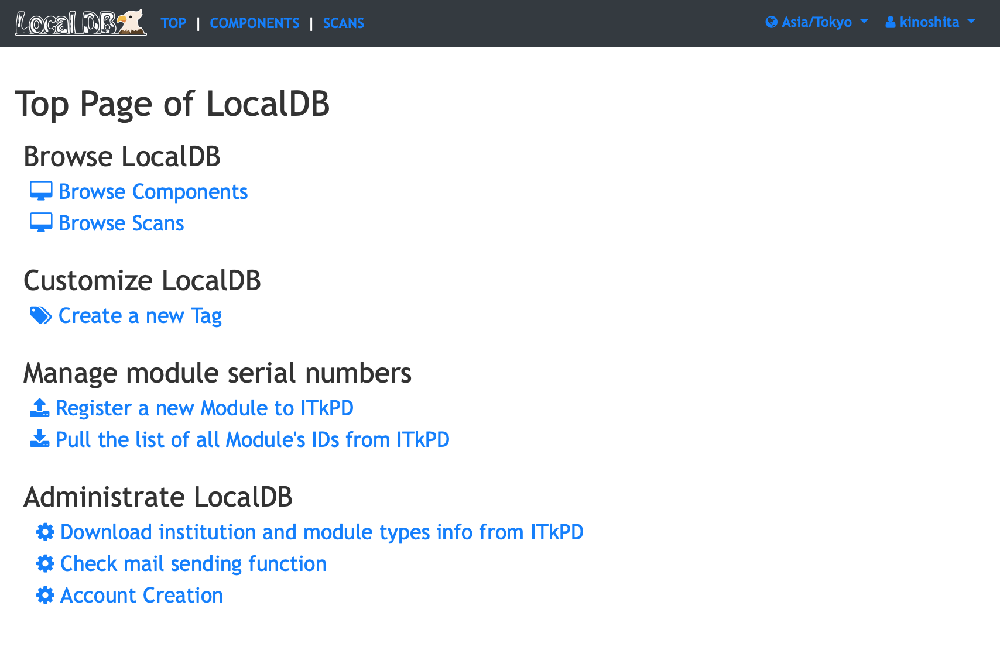
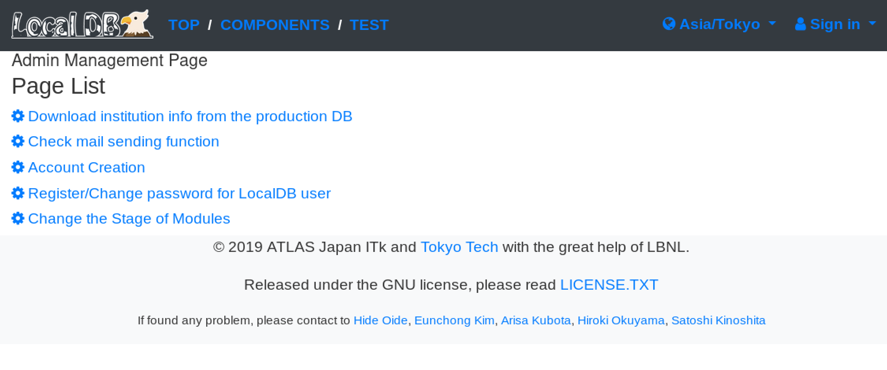

## Admin Page

You can use administrator functions in the admin page if you have an account with administrator privilege.

!!! Note
    The account with administrator privilege here is an administrator account registered in Local DB
    and can be created by [create_admin.sh](../script/create_admin.md) shell. 

#### Authentication

##### 1. Click **Sign in** on the top right:

||
|:-:|

 

##### 2. Click **Admin Page**:

||
|:-:|

 

##### 3. Enter username and password of the administrator acciount and click **OK**:

||
|:-:|
 

##### 4. You can get the admin management page if authentication successful:

||
|:-:|
 

#### Account Creation

