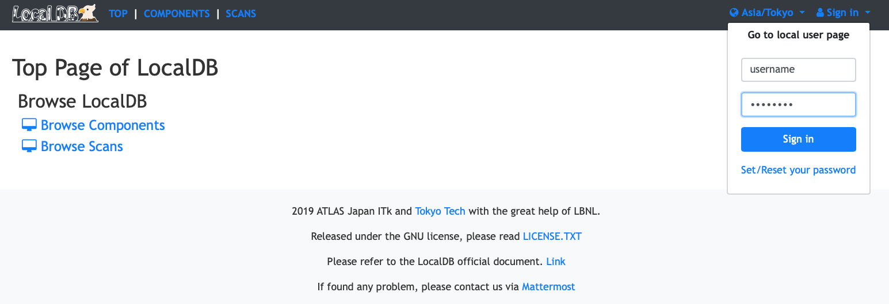
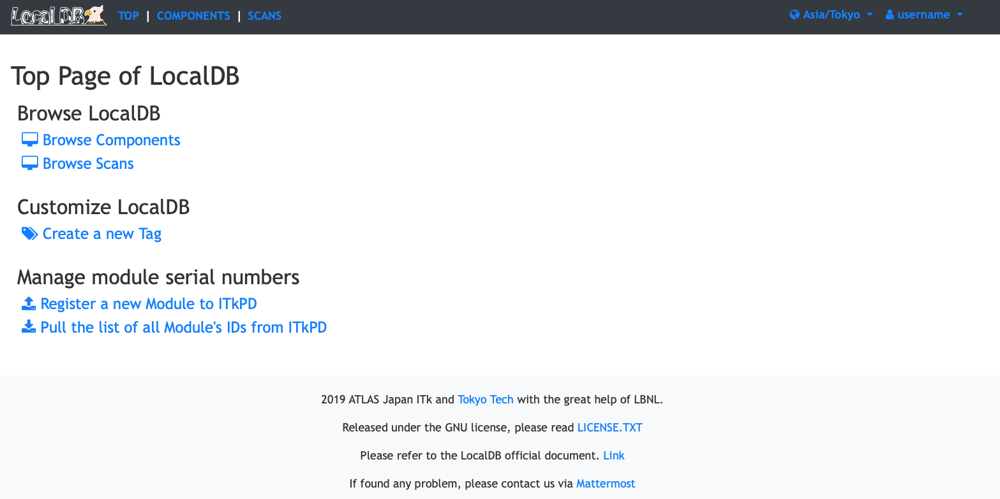

# User Page

You can sign-in and use vaious functions (create tag, edit comment, download ITk PD module) if you have your account in the Local DB.

!!! Note
    If you do not have such an account, you need to ask Local DB administrator of your institution to create your account.

### Functions

- [Sign in](#sign-in)
- [Tag Creation](#tag-creation)
- [Component Download](#component-download)

---

## Sign-in

##### 1. After sign up accroding to the [received mail from the administrator](admin.md#user-creation), click **sign in** on the top right:

||
|:-:|

 

##### 2. Enter username and password of your user account and click **Sign in** to sign in with your account:

||
|:-:|

 

##### 3. You can sign in if authentication successful:

||
|:-:|

 

## Tag Creation

in edit.

## Component Download

in edit.

